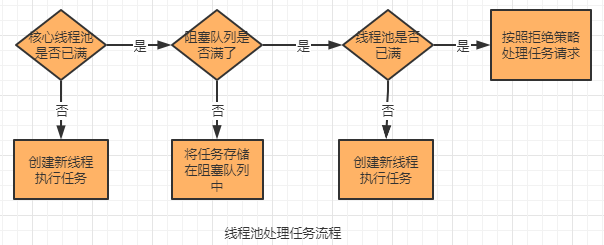

# 线程池


**线程池的好处**

* 降低资源消耗：无需重新创建销毁线程，重复利用
* 提高响应速度：无需等待创建线程，任务可立即执行
* 统一管理线程：线程池可以统一分配、调优、监控


## 线程池的参数

构造函数7个参数

new ThreadPoolExecutor(corePoolSize,maximumPoolSize,keepAliveTime,unit,workQueue,threadFactory,handler)

* **int corePoolSize**

核心线程数，线程池的基本大小

* **int maximumPoolSize,**

允许创建的最大线程数，当线程池满了，阻塞队列也满了，将会创建新的线程，最大线程数=核心线程数+阻塞队列长度

* **long keepAliveTime**

线程空闲存活时间，当线程没有任务执行时，存活的时间，时间到了将会摧毁线程

* **TimeUnit unit**

线程空闲存活时间单位

* **BlockingQueue<Runnable> workQueue**

  阻塞队列，当线程池满了以后，其他线程将会进入阻塞队列中等待。

  * ArrayBlockingQueue:基于数组的有界阻塞队列，FIFO
  * LinkedBlockingQueue:基于链表的阻塞队列
  * SynchronousQueue:不存储元素的阻塞队列。
  * PriorityBlockingQueue:具有优先级的无限阻塞队列

* **ThreadFactory threadFactory,**

  线程工厂，设置创建线程的工厂，默认使用DefaultThreadFactory

  * DefaultThreadFactory:默认工厂
  * PrivilegedThreadFactory：

* **RejectedExecutionHandler handler**

  拒绝策略，当队列和线程池都满了，无法处理新任务时的拒绝策略。

  * AbortPolicy:直接抛出异常，默认handler
  * CallerRunsPolicy：只使用调用者线程来执行任务
  * DiscardOldestPolicy：丢弃最旧的未处理请求
  * DiscardPolicy：不处理，丢弃掉


## 线程池的处理流程

1. 判断核心线程里的线程是否都在执行任务，如果不是，创建一个新线程来执行任务
2. 如果核心线程的线程都在执行任务，判断工作队列是否满了。如果没满，将新提交的任务存储在工作队列里。
3. 如果工作队列满了，判断线程池中所有的线程数是否超过最大线程数。如果没有，创建一个新的线程来执行任务
4. 如果线工作队列满了，线程池中的线程数达到最大线程数了，执行拒绝策略处理任务



## 线程池原理

### 核心变量 ctl

高3位:runState生命周期

* running=-1 (100)   允许接收新任务
* shutdown=0 (000)   不允许接收新任务,但是会继续处理队列任务(调用shutdown()方法)
* stop=1 (001)   不接受新任务,不处理队列任务,中断正在进行的任务(调用shutdownNow()方法)
* tidying (010)  当所有进行的任务中断后,workerCount=0,由stop状态转为tidying状态,并执行terminated()方法
* terminated (011)  当执行完terminated()方法后,由tidying状态转为terminated状态


低29位:workerCount有效线程数量

* 即workerCount最大为2^29-1

### 内部类Worker

Worder继承了AQS,实现了Runnable接口,作为执行的任务,

**Worker成员变量** 

* final Thread thread  线程工厂分配的线程,分配线程时给线程传入this(当前worker)
* Runnable firstTask  需要执行的任务


## 常用的线程池

#### **newCachedThreadPool**

```java
public static ExecutorService newCachedThreadPool() {
    return new ThreadPoolExecutor(0, Integer.MAX_VALUE,
                                  60L, TimeUnit.SECONDS,
                                  new SynchronousQueue<Runnable>());
}
```

#### **newFixedThreadPool**

```java
public static ExecutorService newFixedThreadPool(int nThreads) {
    return new ThreadPoolExecutor(nThreads, nThreads,
                                  0L, TimeUnit.MILLISECONDS,
                                  new LinkedBlockingQueue<Runnable>());
}
```

#### **newSingleThreadExecutor**

```java
public static ExecutorService newSingleThreadExecutor() {
    return new FinalizableDelegatedExecutorService
        (new ThreadPoolExecutor(1, 1,
                                0L, TimeUnit.MILLISECONDS,
                                new LinkedBlockingQueue<Runnable>()));
}
```

#### **newScheduleThreadPool**

```java
public static ScheduledExecutorService newScheduledThreadPool(int corePoolSize) {
    return new ScheduledThreadPoolExecutor(corePoolSize);
}
```