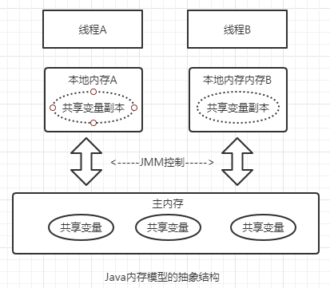

# Java内存模型

**Java内存模型**即Java Memory Model，简称JMM。

JMM的主要目的是定义程序中各种变量的访问规则。

JMM定义了Java 虚拟机(JVM)在计算机内存(RAM)中的工作方式。

JVM是整个计算机虚拟模型，所以JMM是隶属于JVM的。


## Java内存模型基础

线程之前如何通信和同步

#### 线程之间如何通信

在命令式编程中，线程间的通信有两种：**内存共享**和**消息传递**

* 内存共享：线程之间共享共享的公共状态，通过读-写内存中的公共状态进行隐式通信。如共享对象
* 消息传递：线程之间通过发送消息来显示进行通信，如wait()和notify()

#### 线程间如何同步

同步是指程序中用于控制不同线程间操作发生相对顺序的机制。

在内存共享并发模型里，同步是显式进行的，程序员必须显式指定某个方法或代码需要互斥执行。

#### Java内存模型抽象结构

Java线程间的通信由Java内存模型（JMM）进行控制，JMM决定一个线程对共享变量的写入何时对另一个线程可见。



## 主内存与工作内存

Java内存模型规定了所有的变量都存储在主内存，每条线程还有自己的工作内存，工作内存中保存了被该线程使用的变量的主内存副本。

###  内存交互操作

一个变量怎么从主内存拷贝到工作内存，怎么从工作内存同步回主内存，由以下8种操作实现


**Java虚拟机保证下面的每一个操作是原子的**

* lock(锁定)：作用于主内存，把一个变量标识为一条线程独占的状态。
* unlock(解锁)：作用于主内存的变量，它把一个处于锁定状态的变量释放出来，释放后的变量才可以被其他线程锁定。
* read(读取)：作用于主内存的变量，它把一个变量的值从主内存传输到工作内存种
* load(载入)：作用于工作内存的变量，它把read读取的值放入工作内存的变量副本里。
* use(使用)：作用于工作内存的变量，它把工作内存中一个变量的值传递给执行引擎
* assign(赋值)：作用于工作内存的变量，它把一个从执行引擎接收的值赋值给工作内存的变量
* store(存储)：作用于工作内存的变量，它把工作内存中一个变量的值传送到主内存中
* write(写入)：作用于主内存的变量，它把从工作内存中得到得变量放入主内存得变量中。


**JMM规定上述操作必须满足以下规则：**

* read和load是原子操作，store和write是原子操作。
* 不允许丢弃assign操作，执行了assign操作必须执行后面的store和write操作
* 不允许不执行assign操作就执行store和write操作
* 新变量只能在主内存产生，不允许工作内存使用未初始化的变量
* 一个变量在同一时刻只允许一条线程对其进行lock操作，但可以被同一条线程多次lock
* 如果对一个变量执行lock操作，将会清空工作内存中该变量的值，执行引擎使用时依然要先执行load操作
* 只能对当前线程lock的变量执行unlock操作，
* 对一个变量执行unlock前，必须先把此变量同步回主内存。


## 重排序

重排序是指编译器和处理器为了优化程序性能而对指令序列进行重新排序的一种手段


### 数据依赖性

如果两个操作访问同一个变量，其中一个操作为写操作，那么这两个操作就存在数据依赖性

| 名称   | 代码实例 | 说明                       |
| ------ | -------- | -------------------------- |
| 写后读 | a=1;b=a; | 写一个变量后，再读这个变量 |
| 写后写 | a=1;a=2; | 写一个变量后，再写这个变量 |
| 读后写 | a=b;b=1; | 读一个变量后，再写这个变量 |

如果对存在数据依赖性的操作重排序，程序的执行结构就会改变。

**编译器和处理器在重排序时，会遵守数据依赖性**

> 数据依赖性指针对单处理器，单线程。


### as-if-serial语义

as-if-serial语义是指：不管怎么重排序，单线程程序的执行结果不能被改变。

## 先行发生（happens-before）原则

happens-before指定了两个操作之间的执行顺序。


在以下代码中存在3种happens-before关系：

* a happens-before b
* b happens-before c
* a happens-before c

```java
int a = 0;
int b = 1;
int c = a*b;
```


**happens-before 规则**

1. 程序顺序规则：一个线程种的每个操作，happens-before于该线程的任意后续操作。
2. 监视器锁规则：对一个锁的解锁，happens-before 于随后对这个锁的加锁。
3. volatile变量规则：对于一个volatile域的写，happens-before 于任意后续对这个volatile域的读。
4. 传递性：如果A happens-before B，且B happens-before C，那么A happens-before C
5. start()规则：如果在线程A中执行ThreadB.start() （启动线程B），那么线程A的ThreadB.start()操作happens-before于线程B种的任何操作
6. join()规则：如果线程A执行操作ThreadB.join()并成功返回，那么线程B中的任何操作happens-before于线程A从ThreadB.join()操作成功返回。


## 顺序一致性


## volatie的内存语义

volatile变量具有下列特性：

* 可见性：对一个volatile变量的读，总是能看到任意线程对该变量的最后写入。
* 原子性：对任何单个volatile变量的读写操作具有原子性
* 禁止指令重排


### 1.volatile的内存语义

volatile的写内存语义：当写一个volatile变量时，JMM会立刻把该线程对于的本地内存中的共享变量值刷新到主内存

volatile的读内存语义：当读一个volatile变量时，JMM会把该线程对应的本地内存置为无效。线程接下来将从主内存中读取共享变量。

### 2.volatile内存屏障

为实现volatile内存语义，JMM禁止了编译器和处理器重排序，通过内存屏障实现


**内存屏障**是在读写操作的前后添加一个lock前缀的操作，其作用是将本处理器的缓存写入了内存，同时引起其他处理器或别的内核无效化其缓存，相当于对缓存中的变量做了一次store和write操作

#### JMM下对volatile的特殊规则

* read、load、use三个操作是必须连续且一起出现。

> 这条规则要求在工作内存中，每次使用变量前，都必须先从主内存刷新最新的值，用于保证能看见其他线程对变量V所做的修改

* assign、store、write三个操作是必须连续且一起出现。

> 这条规则要求在工作内存中，每次修改变量后都必须立刻同步回主内存中，用于保证其他线程看到自己对变量做出的修改

* 


**JMM内存屏障插入策略**

* 在每一个volatile写操作的前面插入一个StoreStore屏障
* 在每一个volatile写操作的后面插入一个StoreLoad屏障
* 在每一个volatile读操作的后面插入一个LoadLoad屏障
* 在每一个volatile读操作的后面插入一个LoadStore屏障


**StoreStore屏障**：禁止屏障之前的普通写和屏障之后的volatile写重排序

**StoreLoad屏障**：禁止屏障之前的volatile写与屏障之后的volatile读/写重排序

**LoadLoad屏障**：禁止屏障之前的volatile读和屏障之后的普通读重排序

**LoadStore屏障**:禁止屏障之前的volatile读和屏障之后的普通读重排序


## 锁的内存语义

### 1.锁的内存语义

**锁释放—获取建立的happens-before关系**

根据监视器锁规则：释放锁的线程happens-before获取锁的线程


**锁释放内存语义**：当锁释放时，JMM会把该线程对应的本地内存中的共享变量刷新到主内存中。

**锁获取的内存语义**：当锁获取时，JMM会把该线程对应的本地内存置为无效。


### 2.锁内存语义的实现

从**ReentrantLock**方法分析锁内存语义的实现机制。

* 在**ReentrantLock**中调用lock()方法获取锁，调用unlock()方法释放锁
* **ReentrantLock**的实现依赖于Java同步器框架AbstractQueuedSynchronizer（AQS）
* AQS通过一个整型的volatile变量(变量名：state)来维护同步状态，每当有线程获取锁，state加一，反之减一，state为零释放锁。
* **ReentrantLock**分为公平锁FairSync和非公平锁NonfairSync，这是两个内部类


#### 1）公平锁（加锁）

以公平锁为例，**ReentrantLock**.lock()方法执行顺序

1. **ReentrantLock**.lock();
2. FairSync.lock();
3. AbstractQueuedSynchronizer.acquire(int arg);
4. ReentrantLock.tryAcquire(int acquires);


**tryAcquire**

```java
protected final boolean tryAcquire(int acquires) {
    final Thread current = Thread.currentThread();
    int c = getState();//获取volatile变量state的值，即同步状态
    if (c == 0) {//判断当前同步状态是否为
        if (!hasQueuedPredecessors() &&
            compareAndSetState(0, acquires)) {
            setExclusiveOwnerThread(current);
            return true;
        }
    }
    else if (current == getExclusiveOwnerThread()) {
        int nextc = c + acquires;
        if (nextc < 0)
            throw new Error("Maximum lock count exceeded");
        setState(nextc);
        return true;
    }
    return false;
}
```


#### 2）解锁

解锁方法unlock()方法的执行顺序

1. **ReentrantLock**.unlock();
2. AbstractQueuedSynchronizer.release(int arg);
3. Sync.tryRelease(int releases);


**tryRelease**

```java
protected final boolean tryRelease(int releases) {
    int c = getState() - releases;
    if (Thread.currentThread() != getExclusiveOwnerThread())
        throw new IllegalMonitorStateException();
    boolean free = false;
    if (c == 0) {
        free = true;
        setExclusiveOwnerThread(null);
    }
    setState(c);//释放锁的最后，更新锁状态
    return free;
}
```


公平锁在释放锁的最后写volatile变量state，获取锁的线程读取同一个volatile变量。

根据volatile的happens-before规则，写读操作是可见的，所以释放锁的线程的共享变量对获取锁的线程是可见的。

#### 3）非公平锁（加锁）

非公平锁的释放和公平锁完全一样。

非公平锁的加锁顺序：

1. **ReentrantLock**.unlock();
2. NonfairSync.lock();
3. AbstractQueuedSynchronizer.compareAndSetState(int expect,int update)


**compareAndSetState**

```java
protected final boolean compareAndSetState(int expect, int update) {
    // See below for intrinsics setup to support this
    return unsafe.compareAndSwapInt(this, stateOffset, expect, update);
}
```

由上可知非公平锁在加锁时是调用了CAS进行原子操作，使state加一。

CAS操作具有volatile读和写的内存语义。

