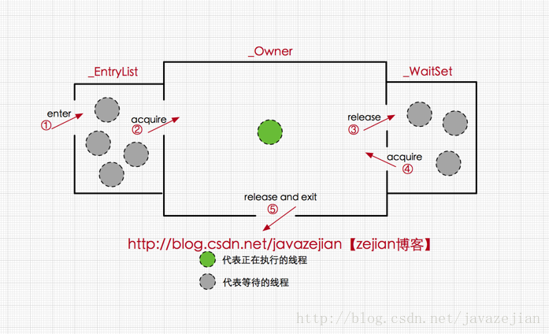

## synchronized同步锁（内置锁）

synchronized是内置锁，隐式锁。互斥锁、可重入锁。

synchronized可以保证可见性

### 1.synchronized的三种使用方式

#### 1）修饰实例方法：

锁住了调用该方法的实例对象，进入该方法需要获取对象实例的锁。

```java
public synchronized void hello(){
    System.out.println("hello");
}
```

一个线程获取了该实例对象的锁并进入该方法，其他线程无法获取实例对象锁，也就不能执行该方法，同时也无法执行该实例对象的其他synchronized修饰的方法，因为获取不到对象锁。

#### 2）修饰静态方法

锁住了该方法所在的类，进入该方法需要获取类对象class的锁

```java
public static synchronized void hello(){
    System.out.println("hello");
}
```

#### 3）修饰代码块

可指定加锁对象，进入该代码块需要获取给定对象的锁

```java
synchronized(this){//这里锁住的是代码块所在的实例对象的锁
	System.out.println("hello");
}
```

### 2.synchronized实现原理

#### Java对象头与Monitor监视器

**对象头**

在JVM中，实例对象存储在堆区域，每一个对象有三部分组成：对象头，实例数据、填充数据

对象头的组成如下：


其中的锁状态即为Synchonized的不同状态。

其中轻量级锁和偏向锁是Java 6对synchonized锁进行优化后新增的。

**Monitor监视器**

每一个对象都存在着一个monitor对象与之关联，在重量级锁状态指向的指针即为monitor对象。

当一个monitor对象被某个线程持有后，便进入锁定状态。

在Java虚拟机（hotspot）中，monitor是由ObjectMonitor实现的（C++）


ObjectMonitor中有两个队列，_EntryList和_WaitSet。

1. 当多个线程获取Monitor时，会进入_EntryList集合

2. 当线程获取到Monitor对象后，将进入_Owner区域，将owner变量设置为当前线程，并使计数器count加1
3. 当线程调用wait()方法时将释放monitor，owner变量置为null，count减1，并进入_WaitSet集合中等待唤醒



#### synchronized代码块和synchronized方法底层原理

在synchronized代码块的实现中，使用的是monitorenter 和 monitorexit 指令。

当执行monitorenter指令时，当前线程会尝试获取monitor的持有权

当执行monitorexit指令时，当前线程会释放monitor。


在synchronized方法的实现中，无需通过字节码指令实现。在方法表中指定一个字段区分该方法是否为同步方法。

当方法调用时，会先检查该字段是否设置，如果设置了则当前线程先持有monitor，然后再执行方法，最后释放monitor

### 3.synchronized锁的优化

#### 偏向锁

偏向锁的核心思想是，如果一个线程获取了锁，那么锁进入偏向模式，该对象的对象头也将偏向锁结构，记录当前线程id。

当这个线程再次获取锁时，将不需要做同步操作，即获取锁的过程，直接执行方法。

#### 轻量级锁

若synchronized升级为偏向锁后，有其他线程竞争锁，synchronized将会升级为轻量级锁，对象头的结构也会变成轻量级锁结构，指向栈中锁的记录，如果存在同一时间访问同一锁的场合，就会导致轻量级锁膨胀为重量级锁。

#### 自旋锁

在轻量级锁的情况下，如果有其他线程想要获取锁，虚拟机会让这些线程循环尝试获取锁（自旋），默认是10次，可以通过JVM参数设置。如果自旋后依然获取不到锁，那么会导致synchronized膨胀升级为重量级锁。

#### 锁消除

锁消除是指虚拟机即时编译时，如果监测到不可能存在共享数据竞争的锁时，会进行消除，同步加锁将不会进行。

### 4.synchronized

#### 可重入

synchronzied可以重入，即允许在synchronized代码块或方法里，再次执行该对象的另一个synchronized代码块或方法

#### 中断与synchronized

对象的wait()、notify()方法必须在synchronized中使用。

本质上wait()方法是释放锁，并进入monitor的_WaitSet区域中等待唤醒，如果没有synchronzied也就没有获取锁，

notify()方法也是释放锁，将锁交给其他线程，唤醒它们，如果没有锁就不能释放

**sleep方法会使线程休眠但不会释放锁，wait方法会释放锁**

## Lock接口

Lock接口的实现基本都是通过聚合了一个AQS同步器的子类来完成线程访问控制的。

## AQS队列同步器

队列同步器AbstractQueuedSynchronizer（AQS），是用来构建锁或者其他同步组件的基础框架。


**AQS要点**

* AQS是一个抽象类，子类通过继承同步器并实现抽象方法来管理同步状态

* 它使用了一个volatile的int成员变量控制同步状态
* 通过内置的FIFO队列来完成资源获取线程的排队工作。
* AQS使用了模板设计模式


### 1.AQS的接口

AQS提供三个protected方法来访问或修改同步状态。

```java
protected final long getState()//获取当前同步状态
protected final void setState(long newState)//设置当前同步状态
protected final boolean compareAndSetState(long expect, long update)//使用CAS设置当前状态
```


在实现自定义同步组件时，将会调用同步器提供的模板方法，AQS提供的模板方法分为3类

* 独占式获取与释放同步状态
* 共享式获取与释放同步状态
* 查询同步队列中的等待线程情况


### 2.AQS的实现分析

#### 1）同步队列

同步器依赖内部的同步队列（一个FIFO双向队列）来完成同步状态的管理。

当线程获取同步状态失败时，同步器会将当前线程以及等待状态等信息构造成为一个Node节点（AQS的静态内部类），并将其加入同步队列，同时回阻塞当前线程，当同步状态释放时，会把首节点（head）的线程唤醒，使其再次尝试获取同步状态。


**AQS成员变量**：

```java
private transient volatile Node head;//阻塞队列首节点
private transient volatile Node tail;//阻塞队列尾节点
private volatile int state;//同步状态
```

**Node阻塞队列节点**

```java
volatile int waitStatus;//等待状态
volatile Node prev;//队列中的上一节点
volatile Node next;//队列中的下一节点
volatile Thread thread;//获取同步状态的线程
Node nextWaiter;//
```


#### 2）.独占式同步状态（独占锁）获取与释放

##### 获取acquire(int arg)


通过调用AQS的acquire(int arg)方法可以获取同步状态。

该方法对中断不敏感，即线程进入同步队列后，如果对线程进行中断操作，线程不会从同步队列移除。

```java
public final void acquire(int arg) {
    if (!tryAcquire(arg) &&
        acquireQueued(addWaiter(Node.EXCLUSIVE), arg))
        selfInterrupt();
}
```


**acquire方法的流程：**

1. 调用自定义同步器的tryAcquire(int arg)方法,获取线程同步状态。该方法需要自定义同步器重写，AQS中默认为抛出异常。
2. 如果获取同步状态失败，将执行addWaiter(Node node)方法，创建包含当前线程的Node节点，并将节点加入同步队列尾部。

```java
private Node addWaiter(Node mode) {
    Node node = new Node(Thread.currentThread(), mode);
    // Try the fast path of enq; backup to full enq on failure
    Node pred = tail;
    //快速尝试在尾部添加，如果尝试CAS添加失败，则进入enq()方法循环CAS添加
    if (pred != null) {
        node.prev = pred;
        if (compareAndSetTail(pred, node)) {
            pred.next = node;
            return node;
        }
    }
    enq(node);
    return node;
}

private Node enq(final Node node) {
    for (;;) {
        Node t = tail;
        if (t == null) { // Must initialize
            if (compareAndSetHead(new Node()))
                tail = head;
        } else {
            node.prev = t;
            if (compareAndSetTail(t, node)) {
                t.next = node;
                return t;
            }
        }
    }
}
```

3. 将节点加入同步队列尾部后，执行acquireQueued（）方法，进入自旋过程，不断尝试获取同步状态，并且只有前驱节点是头节点才能尝试获取同步状态。

**原因：**

* 头节点是成功获取到同步状态的节点，当头节点获取到同步状态后将保持在同步队列中
* 当头节点的线程释放了同步状态后，将唤醒其后继节点，后继节点被唤醒后需要检查自己的前驱节点是否是头节点。
* 维持同步队列的FIFO原则。

```java
final boolean acquireQueued(final Node node, int arg) {
    boolean failed = true;
    try {
        boolean interrupted = false;
        for (;;) {
            final Node p = node.predecessor();//获取当前节点的上前驱节点
            if (p == head && tryAcquire(arg)) {//如果前驱节点为head同时尝试获取同步状态
                setHead(node);//如果当前节点成功获取到同步状态，将当前节点设置为头节点
                p.next = null; // help GC
                failed = false;
                return interrupted;
            }
            if (shouldParkAfterFailedAcquire(p, node) &&
                parkAndCheckInterrupt())
                interrupted = true;
        }
    } finally {
        if (failed)
            cancelAcquire(node);
    }
}
```


##### 释放release(int arg)

通过调用同步器的release(int arg)方法可以释放同步状态。

该方法在释放同步状态之后，会唤醒其后继节点（进而使后继节点重新尝试获取同步状态）

```java
public final boolean release(int arg) {
    if (tryRelease(arg)) {
        Node h = head;
        if (h != null && h.waitStatus != 0)
            unparkSuccessor(h);
        return true;
    }
    return false;
}
```

unparkSuccessor(Node node)方法使用LockSupport来唤醒处于等待状态的线程。


**总结：**

在获取同步状态时，同步器维护一个同步队列，获取状态失败的线程都会加入到队列中并进行自旋；移除队列（或停止自旋）的条件是前驱节点为头节点且成功获取了同步状态。在释放同步状态时，同步器调用tryRelease（int arg）方法释放同步状态，然后唤醒头节点的后继节点。

#### 3）.共享式同步状态（共享锁）获取与释放

共享式获取与独占式获取最主要的区别在于同一时刻能否由多个线程同时获取到同步状态。

在AQS体系的实现有：Semaphore


##### 获取acquireShared(int arg)

通过调用同步器的acquireShared(int arg)方法可以共享式地获取同步状态。

在共享式获取时

```java
public final void acquireShared(int arg) {
    if (tryAcquireShared(arg) < 0)
        doAcquireShared(arg);
}

private void doAcquireShared(int arg) {
    final Node node = addWaiter(Node.SHARED);//将节点放置同步队列末尾
    boolean failed = true;
    try {
        boolean interrupted = false;
        for (;;) {
            final Node p = node.predecessor();
            if (p == head) {
                int r = tryAcquireShared(arg);//尝试获取同步状态
                if (r >= 0) {//如果返回值大于0则表示获取成功
                    setHeadAndPropagate(node, r);
                    p.next = null; // help GC
                    if (interrupted)
                        selfInterrupt();
                    failed = false;
                    return;
                }
            }
            if (shouldParkAfterFailedAcquire(p, node) &&
                parkAndCheckInterrupt())
                interrupted = true;
        }
    } finally {
        if (failed)
            cancelAcquire(node);
    }
}
```

##### 释放releaseShared(int arg)

该方法在释放同步状态后，会唤醒后续处于等待的节点。

与独占式的区别在于tryReleaseShared方法必须保证同步状态线程安全释放，一般是通过循环和CAS来保证的，因为释放同步状态的操作会同时来自多个线程

```java
public final boolean releaseShared(int arg) {
    if (tryReleaseShared(arg)) {
        doReleaseShared();
        return true;
    }
    return false;
}
```

#### 4）.独占式超时获取同步状态

通过调用同步器的doAcquireNanos(int arg, long nanosTimeout)方法可以超时获取同步状态。

即在指定时间段内获取同步状态，如果获取到返回true，否则返回false

```java
private boolean doAcquireNanos(int arg, long nanosTimeout)
        throws InterruptedException {
    if (nanosTimeout <= 0L)
        return false;
    final long deadline = System.nanoTime() + nanosTimeout;
    final Node node = addWaiter(Node.EXCLUSIVE);
    boolean failed = true;
    try {
        for (;;) {
            final Node p = node.predecessor();
            if (p == head && tryAcquire(arg)) {
                setHead(node);
                p.next = null; // help GC
                failed = false;
                return true;
            }
            nanosTimeout = deadline - System.nanoTime();
            if (nanosTimeout <= 0L)
                return false;
            if (shouldParkAfterFailedAcquire(p, node) &&
                nanosTimeout > spinForTimeoutThreshold)
                LockSupport.parkNanos(this, nanosTimeout);
            if (Thread.interrupted())
                throw new InterruptedException();
        }
    } finally {
        if (failed)
            cancelAcquire(node);
    }
}
```

## ReentrantLock重入锁

* 可重入锁：一个线程可以重复加锁
* 独占锁：同一时刻，只能一个线程获取锁
* 公平锁/非公平锁：构造函数可设置公平锁，即按锁请求顺序获取锁，等待时间最长的线程最优获取锁。默认非公平锁。

### 1.实现可重入

重进入是指任意线程在获取到锁之后能够再次获取该锁而不会被锁阻塞。

**需要解决的问题：**

* 线程再次获取锁：锁需要去识别获取锁的线程释放为当前占据锁的线程，如果是，则再次成功获取。
* 锁的最终释放：线程重复了n此获取锁，随后在第n次释放锁后，其他线程能够获取到该锁。可以通过最锁获取计数，每次获取锁计数加1，锁释放时计数自减，当计数等于0时表示锁已经成功释放了。


**非公平锁获取**

```java
final boolean nonfairTryAcquire(int acquires) {
    final Thread current = Thread.currentThread();
    int c = getState();
    if (c == 0) {
        if (compareAndSetState(0, acquires)) {
            setExclusiveOwnerThread(current);
            return true;
        }
    }
    else if (current == getExclusiveOwnerThread()) {//判断当前线程是否为获取锁的线程
        int nextc = c + acquires;//将同步状态值增加并返回true表示获取同步状态成功
        if (nextc < 0) // overflow
            throw new Error("Maximum lock count exceeded");
        setState(nextc);
        return true;
    }
    return false;
}
```

**非公平锁释放**

```java
protected final boolean tryRelease(int releases) {
    int c = getState() - releases;
    if (Thread.currentThread() != getExclusiveOwnerThread())//如果当前线程和独占锁的线程不同，抛出异常
        throw new IllegalMonitorStateException();
    boolean free = false;
    if (c == 0) {//如果释放后同步状态为0，说明锁已经完全释放了，其他线程也可以获取锁
        free = true;
        setExclusiveOwnerThread(null);
    }
    setState(c);
    return free;
}
```


### 2.公平与非公平获取锁的区别

如果一个锁是公平的，那么锁的获取就应该符合请求的绝对时间顺序，也就是FIFO。

公平锁和非公平锁的实现不同在于公平锁的tryAcquire()方法多了一个hasQueuedPredecessors() 方法，用于判断是否有比当前线程更早的线程请求获取锁，如果返回true，则需要等待前驱线程获取并释放锁后才能继续获取锁。

### 3.流程

**非公平锁：lock()流程**

1. 调用Sync.lock();即NonSync.lock();
2. 先尝试直接CAS添加，如果

## ReadWriteLock读写锁

读写锁允许同一时刻多个读线程访问，但是在写线程访问时，所有的读写线程均被阻塞。

读写锁维护了一对锁，一个读锁，一个写锁


### 1.读写锁的接口

JUC提供的读写锁接口是ReadWriteLock，其实现类是ReententReadWriteLock。

ReadWriteLock接口只有两个方法，没有成员变量，

```java
Lock readLock();
Lock writeLock();
```


**ReententReadWriteLock的特性：**

* 公平性选择：支持非公平（默认）和公平的锁获取方式，吞吐量还是非公平优于公平
* 可重入：该锁支持重进入。读线程在获取读锁后，能够再次获取读锁；写线程在获取了写锁之后能够再次获取写锁，同时也可以获取读锁。
* 锁降级：遵循获取写锁、获取读锁再释放写锁的次序，写锁能够降级称为读锁。


### 2.读写锁的实现分析

ReententReadWriteLock的实现主要包括读写状态的设计、写锁的获取与释放、读锁的获取与释放以及锁降级

#### 1.读写状态的设计

读写锁将同步状态变量分为两个部分，高16位表示读状态，低16位表示写状态。

当同步状态值为S，则读状态为S>>16(无符号右移16位，即获取高16位)，写状态为S&0x0000FFFF(将高16位抹去，获取低16位)

当读状态增加1时，等于S+(1<<16);

当写状态增加1时，等于S+1


#### 2.写锁的获取与释放

写锁是一个可重入的排它锁

**流程**

* 如果没有线程获取锁，当前线程获取写锁，增加写状态。

* 如果有线程获取了读锁，则不能获取写锁

* 如果有其他线程获取了写锁，则不能获取写锁

* 当前线程获取了写锁可以再次获取写锁

  

```java
protected final boolean tryAcquire(int acquires) {
    Thread current = Thread.currentThread();
    int c = getState();
    int w = exclusiveCount(c);

    //如果有线程获取了锁
    if (c != 0) {
        // (Note: if c != 0 and w == 0 then shared count != 0)
        //如果获取的锁不是写锁，或者获取锁的线程不是当前线程
        if (w == 0 || current != getExclusiveOwnerThread())
            return false;
        //如果获取锁后超出阈值1<<16
        if (w + exclusiveCount(acquires) > MAX_COUNT)
            throw new Error("Maximum lock count exceeded");
        // Reentrant acquire
        //成功获取锁，更新同步状态
        setState(c + acquires);
        return true;
    }
    // 没有线程获取锁
    if (writerShouldBlock() ||
        !compareAndSetState(c, c + acquires))
        return false;
    // 设置当前线程为独占锁
    setExclusiveOwnerThread(current);
    return true;
}
```

#### 3.读锁的获取与释放

读锁是一个可重入的共享锁，能够被多个线程同时获取


* 其他线程获取了写锁，则当前线程不能获取读锁，进入等待状态。
* 当前线程获取写锁后可以再次获取读锁
* 读锁可以同时被多个线程获取，

```java
protected final int tryAcquireShared(int unused) {
    Thread current = Thread.currentThread();
    int c = getState();
    //如果有线程获取了写锁且不是当前线程，返回-1
    if (exclusiveCount(c) != 0 &&
        getExclusiveOwnerThread() != current)
        return -1;
    //获取读状态
    int r = sharedCount(c);
    //没有其他线程获取写锁
    //判断是否为公平锁需要等待、锁数量超出阈值、CAS丢失
    if (!readerShouldBlock() &&
        r < MAX_COUNT &&
        compareAndSetState(c, c + SHARED_UNIT)) {
        if (r == 0) { //如果没有线程获取了读锁，将当前线程设置为firstReader（第一个获取读锁的线程）
            firstReader = current;
            firstReaderHoldCount = 1;
        } else if (firstReader == current) {//如果有线程获取了读锁且是当前线程，则firstReaderHoldCount（第一个线程获取读锁的数量）加1
            firstReaderHoldCount++;
        } else {//如果有其他线程获取了读锁
            HoldCounter rh = cachedHoldCounter;
            if (rh == null || rh.tid != getThreadId(current))
                cachedHoldCounter = rh = readHolds.get();
            else if (rh.count == 0)
                readHolds.set(rh);
            rh.count++;
        }
        return 1;//获取锁成功返回1
    }
    //如果上述因存在等待时间更久的锁、锁数量超出阈值、CAS丢失等没有获取锁，执行fullTryAcquireShared()方法自旋获取锁
    return fullTryAcquireShared(current);
}
```

#### 4.锁降级

锁降级指如果当前线程拥有写锁，再获取到读锁，随后释放写锁的过程，这个过程中写锁降级成为读锁。

**锁降级的目的是为了保证数据的可见性**

*锁降级案例*

```java
int a = 0;
try{
	write.lock();
    a = 1;
	read.lock();
}finally{
    write.unlock();
}
//如果没有获取读锁，其他线程获取了写锁修改了a的数据，下面的代码使用的a仍然是当前线程修改的a数据。
//即其他线程修改的a对当前线程不可见。
try{
a = a + 1;//此时读到的a是写锁中修改的a = 1；计算后a=2；
}finally{
    read.unlock();
}
//最终a = 2;
```


## LockSupport 工具

当需要阻塞或唤醒一个线程的时候，都会使用LockSupport工具类来完成相应的工作

本质是调用了UNSAFE的底层park()方法


## Condition接口

synchronized关键字与Object的wait()、notify()方法等可以实现通知/等待模式

Lock接口与Condition接口配合也可以实现通知/等待模式


### 1.Condition接口与实例


### 2.Condition实现分析

Condition的实现类是ConditionObject，是AQS的内部类。

每一个Condition对象都包含着一个队列，该队列是Condition对象实现等待/通知功能的关键。

#### 1）等待队列

等待队列是一个FIFO的队列，在队列的每一个节点（AQS的内部类Node，和同步队列中的节点一样）都包含了一个线程引用。

如果一个线程调用了Condition.await()方法，那么该线程会释放锁，构造Node节点加入等待队列尾部并进入等待状态。


一个Condition包含一个等待队列，Condition拥有首节点（firstWaiter）和尾节点（lastWaiter）


并发包中的Lock拥有一个同步队列和多个等待队列。


#### 2）等待

```java
public final void await() throws InterruptedException {
    //如果线程打断，抛出中断异常
    if (Thread.interrupted())
        throw new InterruptedException();
    //当前线程加入等待队列,并返回队列节点
    Node node = addConditionWaiter();
    //释放锁、唤醒后继节点并返回同步状态
    int savedState = fullyRelease(node);
    int interruptMode = 0;
    while (!isOnSyncQueue(node)) {
        //阻塞当前线程，进入等待状态
        LockSupport.park(this);
        if ((interruptMode = checkInterruptWhileWaiting(node)) != 0)
            break;
    }
    //被唤醒后尝试获取锁
    if (acquireQueued(node, savedState) && interruptMode != THROW_IE)
        interruptMode = REINTERRUPT;
    if (node.nextWaiter != null) // clean up if cancelled
        unlinkCancelledWaiters();
    if (interruptMode != 0)
        reportInterruptAfterWait(interruptMode);
}
```


#### 3) 通知

调用Condition的signal()方法，将会唤醒在等待队列中等待时间最长的节点（首节点）

```java
public final void signal() {
    if (!isHeldExclusively())
        throw new IllegalMonitorStateException();
    Node first = firstWaiter;//首节点
    if (first != null)
        doSignal(first);//唤醒首节点
}
```

doSignal()方法先将首节点从等待队列移除，调用enq()方法将该节点加入同步队列，并使用LockSupport的unpark()方法唤醒

Condition的singalAll（）方法相当于对等待队列中的每一个节点均执行一次signal()方法，将等待队列中所有节点全部移动到同步队列中，并唤醒每个节点的线程。