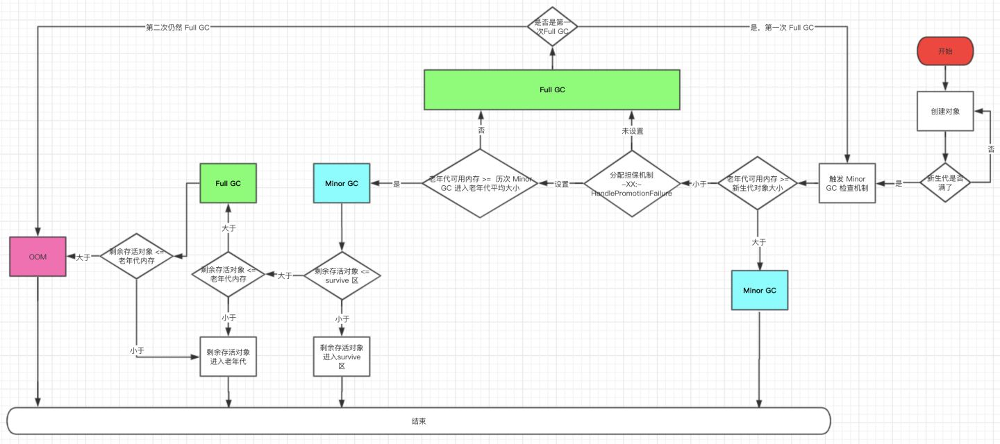

## 哪些内存需要回收？

垃圾收集器在对堆进行回收之前，需要确定哪些对象需要回收内存。

### 1.引用计数法

在对象中添加一个引用计数器，每当有一个地方引用它时，计数器值就加一；当引用失效时，计数器减一；当计数器为零的对象就是不可能再被使用的，就需要回收。

> 在主流的Java虚拟机中都没有选用引用计数法来管理内存，原因是该算法需要考虑很多例外情况，比如两个对象都拥有Object属性，并互相将对方作为属性的引用。此时它们互相引用着对方，计数都不为零，即使不再使用也无法回收它们

### 2.可达性分析算法

通过一系列称为“GC Roots”的根对象作为起始节点集，从这些节点开始，根据引用关系线下搜索，搜索过程走过的路称为“引用链”，如果某个对象到GC Roots间没有任何引用链相连，证明此对象是不可能再使用的。

在Java技术体系里，可以作为GC Roots的对象有：

* 虚拟机栈（栈帧中的本地变量表）中引用的对象
* 方法区中类静态属性引用的对象
* 方法区中常量引用的对象
* 本地方法栈中的JNI（Java Native Interface）引用的对象
* Java虚拟机内部的引用，如基本类型对应的class对象，一些常驻的异常对象NullPointerException、OutOfMemoryError等。还有系统类加载器
* 所有被同步锁持有的对象

⚠如果对象可回收，就一定会回收吗？

不一定，但发生GC时，会先判断对象是否执行了finalize方法，如果未执行则将该对象放置在一个名未F-Queue的队列中，并由Finalizer线程执行它们的finalize方法，如果在方法中将当前对象与GC Roots关联，在执行finalize方法后，GC会再次判断对象是否可回收。

### 引用类型

1. 强引用

强引用是最常见的引用方式，即创建一个对象，比如Object obj = new Object();

2. 软引用

软引用用来描述一些还有用，但非必须的对象，如果内存足够，它不会被系统回收，当系统内存不够时，系统可能会回收它

3. 弱引用

弱引用描述那些非必须的对象，只要垃圾收集器开始工作，就会回收掉弱引用关联的对象

4. 虚引用

虚引用主要用来跟踪对象被垃圾回收的状态，虚引用不能单独使用，必须配合引用队列联合使用。

### 回收方法区

## 什么时候回收内存？

* 在CPU空闲的时候自动进行
* 新生代的Eden区满的时候触发Minor GC
* Serial收集器在老年代剩余内存已经小于晋升老年代的平均大小时进行Full GC
* CMS收集器每隔一段时间检查老年代内存的使用量，超过一定比例进行Full GC
* 主动调用System.gc()后尝试回收内存

## 如何回收内存？

### 1.垃圾收集器

当前的商业虚拟机的垃圾收集器大多遵循了“分代收集”的理论设计，它建立在两个分代假说上：

1. 弱分代假说：绝大多数对象都是朝生夕灭的，创建后不久就消亡
2. 强分代假说：熬过多次垃圾回收过程的对象越难以消亡

**设计原则**：

* 收集器将Java堆划分出不同的区域，将回收对象依据其年龄（即对象熬过垃圾收集过程次数）分配到不同的区域存储
* 一般分为新生代和老年代两个区域，

**垃圾收集的分类**

* 部分收集（Partial GC）：指垃圾回收目标不是完整收集整个Java堆的垃圾回收，又分为：
  * 新生代收集（Minor GC / Young GC)：指目标只是新生代的垃圾收集
  * 老年代收集（Major GC / Old GC)：指目标只是老年代的垃圾收集。目前只有CMS收集器会有单独收集老年代的行为
  * 混合收集（Mixed GC）：指目标是收集整个新生代以及部分老年代的垃圾收集。目前只要G1收集器会有这种行为
* 整堆收集（Full GC）：收集整个Java堆和方法区的垃圾收集。

### 2.垃圾收集算法

#### 1）标记—清除算法

最早出现也是最基础的垃圾收集算法是标记—清除算法。

* 标记：标出(判断)所有需要回收的对象
* 清除：标记完成后，统一回收掉所有被标记的对象

**缺点⚠：**

* 执行效率不稳定，如果Java堆中大部分对象需要标记和回收，就需要进行大量的标记清除动作
* 标记清除后会产生大量不连续的内存碎片，如果有需要分配较大对象时无法找到合适的连续内存而不得不触发另一次垃圾收集

#### 2）标记—复制算法

>  为解决标记-清除算法面对大量可回收对象执行效率低的问题，提出了标记-复制算法。

**流程：**

1. 将可用内存按容量分为大小相等的两块，每次只使用其中的一块
2. 当这一块的内存用完了，就将还活着的对象复制到另一块上，只留下死亡的对象，然后将已使用过的内存空间一次清理掉

⚠如果内存多数对象存活，这种算法会产生大量的内存间复制开销，且内存缩小为原来的一半。

* 当前商用Java虚拟机大多优先采用这种算法区回收新生代

#### 3）标记—整理算法

> 标记—复制算法在对象存活率较高时就要进行较多的复制操作，效率会降低，所以在老年代一般不能选用这种算法，针对老年代对象的存亡特征，提出了另一种有针对性地“标记—整理”算法

**流程：**

1. 标记：标记需要回收地对象
2. 整理：将所有存活的对象都向内存空间一端移动，然后直接清除掉边界意外的内存。

**利弊：**

* 老年代有大量对象存活，移动存活对象将会是一种极为负重的操作，而且必须要全程暂停用户应用程序才能进行。
* 如果不进行移动整理存活对象，分散在堆中的存活对象将导致碎片化问题。

> CMS收集器采用标记—清除算法，当空间的碎片化问题以及达到影响对象分配时采用标记—整理算法收集一次，以获得规整的内存空间

### 3.垃圾收集的名词

#### 1）根节点枚举

#### 2）安全点

#### 3）安全区域

#### 4）记忆集与卡表

#### 5）写屏障

## 经典垃圾收集器

垃圾收集器的配合关系：

### 1.Serial收集器

Serial收集器是最基础、历史最悠久的收集器。

Serial收集器是一个单线程工作的收集器，它在进行垃圾收集时，必须暂停其他所有工作线程，直到它收集结束。

**运行过程：**

* GC线程在新生代采取复制算法，暂停所有用户线程
* GC线程在老年代采取标记—整理算法，暂停所有用户线程

**优点：**在单线程下，额外内存消耗最小

### 2.ParNew收集器

ParNew收集器实质上是Serial收集器的多线程并行版本，除了使用多条线程进行垃圾收集外，其余行为与Serial收集器完全一致。

* 作为新生代收集器，只有ParNew收集器可以与老年代收集器——CMS收集器配合工作

### 3.Parallel Scavenge收集器

Parallel Scavenge收集器也是一款新生代收集器，同样是基于标记—复制算法实现的收集器，也是能够并行收集的多线程收集器。

Parallel Scavenge收集器关注于达到一个可控制的吞吐量

### 4.Serial Old 收集器

Serial Old 收集器是Serial收集器的老年代版本，同样是一个当线程收集器，使用标记—整理算法，

### 5.Parallel Old收集器

Parallel Old收集器是Parallel收集器的老年代版本，支持多线程并发收集，基于标记—整理算法

### 6.CMS收集器

CMS（Concurrent Mark Sweep）收集器是一种以获取最短回收停顿时间为目标的收集器。

CMS收集器是基于标记—清除算法实现的。

**流程：**

1. 初始标记：暂停所有用户进程(stop the world)，标记GC Roots能够直接关联到的对象，
2. 并发标记：从GC Roots的直接关联对象开始遍历整个对象图，这个过程耗时较长但不需要停顿用户线程，可以并发运行
3. 重新标记：修正并发标记期间，用户线程继续运作而导致标记产生变动的那一部分对象的标记记录，这个阶段的停顿时间通常比初始标记阶段稍长一些，但也远比并发标记阶段的时间短
4. 并发清除：清理删除标记阶段判断的已经死亡的对象，由于不需要移动存活对象，这个阶段也是与用户线程并发的

**CMS收集器的缺点：**

* CMS对处理器资源非常敏感。容易导致应用程序变慢，降低总吞吐量

* CMS收集器无法处理浮动垃圾
* 收集结束会有大量空间碎片产生

### 7.Garbage First收集器

## 内存分配与回收策略

流程图

### 1.对象优先在Eden分配

大多数情况下，对象在新生代Eden区中分配。

当Eden区没有足够的空间进行分配时，虚拟机将会发起一次Minor GC。

> -XX:+PrintGCDetails 收集器日志参数，可在虚拟机发生收集行为时打印内存回收日志

### 2.大对象直接进入老年代

大对象指大量连续内存空间的Java对象，典型：很长的字符串或元素数量很庞大的数组。

> -XX:PretenureSizeThreshold 参数指定大于该值的对象直接在老年代分配，这样做的目的是避免在Eden区及两个Survivor区之间来回复制

### 3.长期存活的对象将进入老年代

虚拟机给每一个对象定义了一个对象年龄计数器，存储在对象头中。

对象通常在Eden区诞生

* 如果经过第一次Minor GC后仍然存活，并且能被Survivor容纳，该对象被移到Survivor区并将年龄设置为一岁
* 对象在Survivor区中每熬过一次Minor GC，年龄就增加一岁。
* 当对象的年龄增加到一定程度（默认15）就会晋升到老年代中。

> -XX:MaxTenuringThreshold 参数设置对象晋升老年代的年龄阈值

### 4.动态年龄判定

HotSpot虚拟机中，如果在Survivor空间中相同年龄所有对象大小的总和大于Survivor空间的一半，年龄大于等于该年龄的对象就可以直接进入老年代，无须等到-XX：MaxTenuringThreshold 中的要求的年龄

### 5.空间分配担保

1. 在发生Minor GC之前，虚拟机必须先检查老年代最大可用的连续内存空间是否大于新生代所有对象总空间，如果大于，那么这次Minor GC是安全的；
2. 否则，虚拟机会先查看-XX:HandlerPromotionFailure 参数的设置是否允许担保失败
3. 如果允许担保失败，继续检查老年代最大可用的连续空间是否大于历次晋升到老年代对象的平均大小
4. 如果大于，将尝试进行一次Minor GC，尽管是有风险的
5. 如果小于，或者-XX:HandlerPromotionFailure  设置不允许冒险，那就要改成进行一次Full GC。

> 风险/冒险:新生代使用复制收集算法，但为了内存利用率，只是用其中一个Survivor空间作为轮换备份

 

