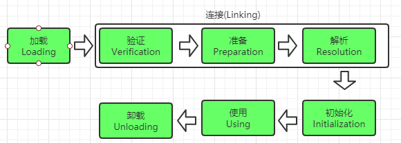
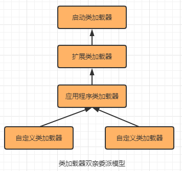

**类加载机制：**

Java虚拟机把描述类的数据从Class文件中加载到内存，并对数据进行校验、转换解析和初始化，最终形成可以被虚拟机直接使用的Java类型。


## 类加载的时机

### 类加载的生命周期

 加载——验证——准备——解析——初始化——使用——卸载


其中验证——准备——解析三个部分统称为连接




## 类加载的过程

### 1.加载

加载阶段，Java虚拟机需要完成：

1. 通过一个类的全限定类名(全类名，包名+类名)来获取定义该类的二进制字节流
2. 将这个字节流所代表的静态存储结构转化为方法区的运行时数据结构。
3. 在Java堆内存中生成一个代表这个类的java.lang.Class对象，作为这个类在方法区的各种数据的访问入口。


**获取类的二进制字节流：**

* 从ZIP压缩包中读取，如JAR包、WAR包
* 运行时计算生成，如动态代理
* 从网络中获取，如Web Applet
* 由其他文件生成，如JSP生成的Class文件
* ......


**对于非数组类型的加载阶段：**由虚拟机内置引导类加载器完成，也可以由用户自定义类加载器去控制加载过程

**对于数组类型的加载阶段：**不通过类加载器创建，由Java虚拟机在内存动态构造出来，数组类的创建过程遵循如下规则：

* 如果数组的组件类型是引用类型
* 如果数组的组件类型不是引用类型（如int[] 数组），Java虚拟机会把数组类标记为与引导类加载器关联


> 加载阶段与连接阶段的部分动作是交叉进行的，加载阶段尚未完成，连接阶段可能已经开始了

### 2.验证

验证是连接阶段的第一步，这一阶段是确保Class文件的字节流中包含的信息符合约束要求。


**流程：**

1. 文件格式验证：验证字节流是否符合Class文件格式的规范
2. 元数据验证：对字节码描述的信息进行语义分析
3. 字节码验证：
4. 符号引用验证：

### 3.准备

准备阶段是正式为类中定义的变量（即静态变量）分配内存并设置类变量初始值的阶段

初始值一般是基本数据类型的零值（如int:0，double:0.0d, boolean:false)

> 即使类变量设置为public static int value = 123
>
> 在准备阶段也会先赋值为0，在初始化阶段再设置为123
>
> **如果静态变量被final修饰，那么在准备阶段就会将初始值设置为当前值**


### 4.解析

解析阶段是Java虚拟机将常量池内的符号替换为直接引用的过程

### 5.初始化

初始化阶段Java虚拟机开始执行类中编写的Java程序代码，将主导权交给应用程序

初始化阶段就是执行类构造器<`clinit`>()方法的过程

> \<clinit\>()方法由编译器自动收集所有的类变量的赋值动作和静态语句快产生的

* 编译器收集顺序是由源文件中出现的顺序决定的，所以静态语句块只能访问定义在之前的变量，定义在它之后的变量可以赋值不能访问

```java
public class Test{
	static{
        i = 0;//给变量赋值可以正常编译通过
        System.out.print(i);//访问会提示“非法向前引用”
    }
    static int i= 1;
}
```

* 执行子类初始化前，先执行父类的初始化。

* 接口执行时不需要先执行父接口的初始化，只有当父接口中定义的变量被使用时，父接口才会被初始化

* 多线程下只有一个线程可以初始化这个类，其他线程都会阻塞等待，唤醒后不会再执行初始化，一个类加载器下，一个类只会初始化一次。

  

### **类初始化时机**

1. 遇到new、getstatic、putstatic或invokestatic这四条字节码指令时，如果类型没有进行初始化，则需要先触发初始化阶段。

   生成这四条字节码的场景有：

   * 使用new关键字实例化对象时
   * 读取或设置一个类型的静态字段（被final修饰、放入常量池的除外）
   * 调用一个类型的静态方法的时候

2. 使用java.lang.reflect包的方法对类型进行反射调用的时候，如果类型没有初始化，则需要先出发其初始化
3. 当初始化类的时候，如果发现其父类还没有进行过初始化，则需要先触发其父类的初始化
4. 当虚拟机启动时，用户需要指定一个要执行的主类（包含main()方法的类），虚拟机会先初始化这个主类
5. 当使用jdk7新加入的动态语言支持时，
6. 当一个接口中定义了jdk8新加入的默认方法（default关键字修饰的接口方法）时，如果有这个接口的实现类发生了初始化，那该接口要在其之前被初始化。


以上六种会触发类型进行初始化的场景行为称为对一个类型的``主动引用``

除主动引用外的所有引用类型的方式都不会触发初始化，称为``被动引用``。如：

* 通过子类调用父类的静态变量，只会初始化父类，而不会初始化子类

* 定义数组时，不会初始化这个数组元素类型，而是触发了一个由虚拟机自动生成，代表了该一维数组的类的初始化阶段，数组中应有的属性和方法都在这个类里
* 调用A类的静态常量时不会触发初始化，因为该常量在编译时已经存储在调用该常量的B类(含有main()方法的类)的常量池中，实际都转化成了B类对自身常量池的引用


> 接口不能使用static语句块，但编译器仍然会为接口生成<clinit>类构造器来初始化接口的成员变量


**接口与类在初始化的区别在上述第3点**：

当一个类在初始化时，要求其父类全部都已经初始化过了，但是一个接口在初始化时，并不要求其父接口全部都完成了初始化，只有在真正用到父接口的时候才会初始化。


## 类加载器

对于任意一个类，都必须由加载它的类加载器和这个类本身一起确定其在Java虚拟机中的唯一性。

* 比较两个类相等，只有在两个类是由同一个类加载器加载的前提下才有意义
* 如果两个类的类加载器不同，即使来源于同一个class文件，被同一个Java虚拟机加载，这个两个类也不同
* 这里的相等包括equals()方法、isInstance()方法，instanceof关键字

### 1.双亲委派模型

> 从Java虚拟机的角度看，只存在两种不同的类加载器：
>
> * 启动类加载器:是虚拟机自身的一部分
> * 其他类加载器：独立存在虚拟机外部，继承自抽象类java.lang.ClassLoader


**三层类加载器**：

* 启动类加载器：负责加载根路径下\lib目录内的类库,如rt.jar\tools.jar
* 扩展类加载器：负责加载根路径下\lib\ext目录中的类库。jdk允许用户将具有通用性的类库放置在ext目录中扩展Java SE的功能
* 应用程序类加载器：负责加载用户类路径（ClassPath）上所有的类库。如果应用程序中没有自定义过类加载器，这个就是默认的类加载器。


**双亲委派模型**

> 双亲委派模型要求除了顶层的启动类加载器，其余的类加载器应当由自己的父类加载器。



**双亲委派模型工作流程**：

* 如果一个类加载器收到了类加载的请求，它首先不会自己去尝试加载这个类，而是把这个请求委派给父类加载器去完成
* 所有的请求最终都会传送到启动类加载器
* 只有当父类反馈自己无法完成这个请求时，子加载器才会尝试自己去完成加载


**双亲委派模型的优点：**不论用户使用的是什么类加载器，只要加载了如java.lang.Object这种类，最终都是委派给启动类加载器。因此Object类在各种类加载器中都能保证是同一个类。


### 2.破坏双亲委派模型

双亲委派模型出现过三次“被破坏”的情况


第一次是双亲委派模型出现之前，为引入双亲委派模型同时兼容已存在的类加载器代码，开发人员不得不为类加载器添加findClass()方法完成加载

第二次是模型自身缺陷，双亲委派模型很好解决了各个类加载器协作时基础类型的一致性问题（越基础的类越由上层加载器加载），但是存在基础类型需要调用用户代码，上层加载器加载后无法调用用户代码（不是由上层类加载器加载的类，无法识别）。开发者引入线程上下文类加载器解决

