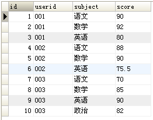
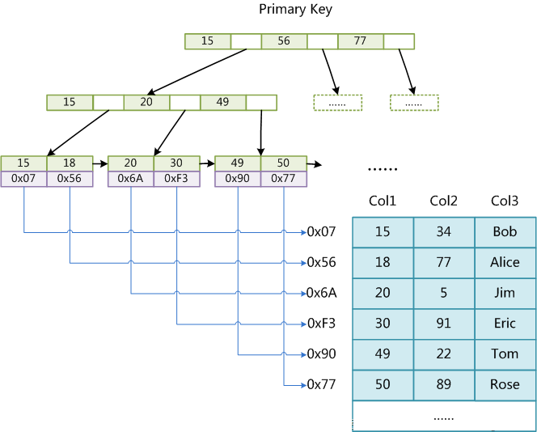
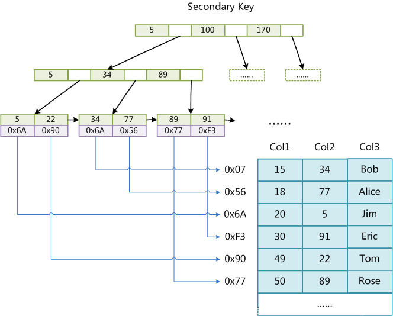
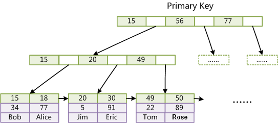
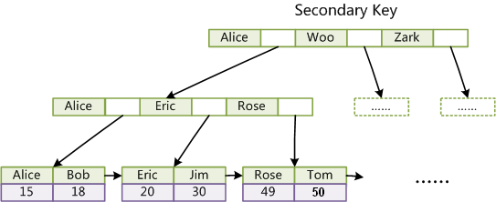
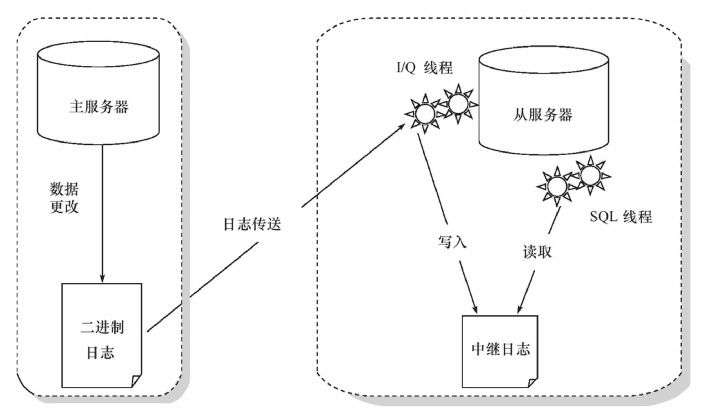

## 1. SQL

#### 1.1 介绍一下数据库分页

**参考答案**

MySQL的分页语法：

在MySQL中，SELECT语句默认返回所有匹配的行，它们可能是指定表中的每个行。为了返回第一行或前几行，可使用LIMIT子句，以实现分页查询。LIMIT子句的语法如下：

```mysql
-- 在所有的查询结果中，返回前5行记录。
SELECT prod_name FROM products LIMIT 5;
-- 在所有的查询结果中，从第5行开始，返回5行记录。
SELECT prod_name FROM products LIMIT 5,5;
```

总之，带一个值的LIMIT总是从第一行开始，给出的数为返回的行数。带两个值的LIMIT可以指定从行号为第一个值的位置开始。

优化LIMIT分页：

在偏移量非常大的时候，例如 `LIMIT 10000,20` 这样的查询，这时MySQL需要查询10020条记录然后只返回最后20条，前面的10000条记录都将被抛弃，这样的代价是非常高的。如果所有的页面被访问的频率都相同，那么这样的查询平均需要访问半个表的数据。要优化这种查询，要么是在页面中限制分页的数量，要么是优化大偏移量的性能。

优化此类分页查询的一个最简单的办法就是尽可能地使用索引覆盖扫描，而不是查询所有的列，然后根据需要做一次关联操作再返回所需的列。对于偏移量很大的时候，这样做的效率会提升非常大。考虑下面的查询：

```mysql
SELECT film_id,description FROM sakila.film ORDER BY title LIMIT 50,5;
```

如果这个表非常大，那么这个查询最好改写成下面的样子：

```mysql
SELECT film.film_id,film.description 
FROM sakila.film
INNER JOIN (
    SELECT film_id FROM sakila.film ORDER BY title LIMIT 50,5
) AS lim USING(film_id);
```

这里的“延迟关联”将大大提升查询效率，它让MySQL扫描尽可能少的页面，获取需要访问的记录后再根据关联列回原表查询需要的所有列。这个技术也可以用于优化关联查询中的LIMIT子句。

有时候也可以将LIMIT查询转换为已知位置的查询，让MySQL通过范围扫描获得对应的结果。例如，如果在一个位置列上有索引，并且预先计算出了边界值，上面的查询就可以改写为：

```mysql
SELECT film_id,description FROM skila.film
WHERE position BETWEEN 50 AND 54 ORDER BY position;
```

对数据进行排名的问题也与此类似，但往往还会同时和GROUP BY混合使用，在这种情况下通常都需要预先计算并存储排名信息。

LIMIT和OFFSET的问题，其实是OFFSET的问题，它会导致MySQL扫描大量不需要的行然后再抛弃掉。如果可以使用书签记录上次取数的位置，那么下次就可以直接从该书签记录的位置开始扫描，这样就可以避免使用OFFSET。例如，若需要按照租赁记录做翻页，那么可以根据最新一条租赁记录向后追溯，这种做法可行是因为租赁记录的主键是单调增长的。首先使用下面的查询获得第一组结果：

```mysql
SELECT * FROM sakila.rental ORDER BY rental_id DESC LIMIT 20;
```

假设上面的查询返回的是主键16049到16030的租赁记录，那么下一页查询就可以从16030这个点开始：

```mysql
SELECT * FROM sakila.rental 
WHERE rental_id < 16030 ORDER BY rental_id DESC LIMIT 20;
```

该技术的好处是无论翻页到多么后面，其性能都会很好。

#### 1.2 介绍一下SQL中的聚合函数

**参考答案**

常用的聚合函数有COUNT()、AVG()、SUM()、MAX()、MIN()，下面以MySQL为例，说明这些函数的作用。

COUNT()函数：

COUNT()函数统计数据表中包含的记录行的总数，或者根据查询结果返回列中包含的数据行数，它有两种用法：

- COUNT(*)计算表中总的行数，不管某列是否有数值或者为空值。
- COUNT(字段名)计算指定列下总的行数，计算时将忽略空值的行。

COUNT()函数可以与GROUP BY一起使用来计算每个分组的总和。

AVG()函数()：

AVG()函数通过计算返回的行数和每一行数据的和，求得指定列数据的平均值。

AVG()函数可以与GROUP BY一起使用，来计算每个分组的平均值。

SUM()函数：

SUM()是一个求总和的函数，返回指定列值的总和。

SUM()可以与GROUP BY一起使用，来计算每个分组的总和。

MAX()函数：

MAX()返回指定列中的最大值。

MAX()也可以和GROUP BY关键字一起使用，求每个分组中的最大值。

MAX()函数不仅适用于查找数值类型，也可应用于字符类型。

MIN()函数：

MIN()返回查询列中的最小值。

MIN()也可以和GROUP BY关键字一起使用，求出每个分组中的最小值。

MIN()函数与MAX()函数类似，不仅适用于查找数值类型，也可应用于字符类型。

#### 1.3 表跟表是怎么关联的？

**参考答案**

表与表之间常用的关联方式有两种：内连接、外连接，下面以MySQL为例来说明这两种连接方式。

内连接：

内连接通过INNER JOIN来实现，它将返回两张表中满足连接条件的数据，不满足条件的数据不会查询出来。

外连接：

外连接通过OUTER JOIN来实现，它会返回两张表中满足连接条件的数据，同时返回不满足连接条件的数据。外连接有两种形式：左外连接（LEFT OUTER JOIN）、右外连接（RIGHT OUTER JOIN）。

- 左外连接：可以简称为左连接（LEFT JOIN），它会返回左表中的所有记录和右表中满足连接条件的记录。
- 右外连接：可以简称为右连接（RIGHT JOIN），它会返回右表中的所有记录和左表中满足连接条件的记录。

除此之外，还有一种常见的连接方式：等值连接。这种连接是通过WHERE子句中的条件，将两张表连接在一起，它的实际效果等同于内连接。出于语义清晰的考虑，一般更建议使用内连接，而不是等值连接。

以上是从语法上来说明表与表之间关联的实现方式，而从表的关系上来说，比较常见的关联关系有：一对多关联、多对多关联、自关联。

- 一对多关联：这种关联形式最为常见，一般是两张表具有主从关系，并且以主表的主键关联从表的外键来实现这种关联关系。另外，以从表的角度来看，它们是具有多对一关系的，所以不再赘述多对一关联了。
- 多对多关联：这种关联关系比较复杂，如果两张表具有多对多的关系，那么它们之间需要有一张中间表来作为衔接，以实现这种关联关系。这个中间表要设计两列，分别存储那两张表的主键。因此，这两张表中的任何一方，都与中间表形成了一对多关系，从而在这个中间表上建立起了多对多关系。
- 自关联：自关联就是一张表自己与自己相关联，为了避免表名的冲突，需要在关联时通过别名将它们当做两张表来看待。一般在表中数据具有层级（树状）时，可以采用自关联一次性查询出多层级的数据。

#### 1.4 说一说你对外连接的了解

**参考答案**

外连接通过OUTER JOIN来实现，它会返回两张表中满足连接条件的数据，同时返回不满足连接条件的数据。常见的外连接有两种形式：左外连接（LEFT OUTER JOIN）、右外连接（RIGHT OUTER JOIN）。

- 左外连接：可以简称为左连接（LEFT JOIN），它会返回左表中的所有记录和右表中满足连接条件的记录。
- 右外连接：可以简称为右连接（RIGHT JOIN），它会返回右表中的所有记录和左表中满足连接条件的记录。

实际上，外连接还有一种形式：完全外连接（FULL OUTER JOIN），但MySQL不支持这种形式。

#### 1.5 说一说数据库的左连接和右连接

**参考答案**

外连接通过OUTER JOIN来实现，它会返回两张表中满足连接条件的数据，同时返回不满足连接条件的数据。常见的外连接有两种形式：左外连接（LEFT OUTER JOIN）、右外连接（RIGHT OUTER JOIN）。

- 左外连接：可以简称为左连接（LEFT JOIN），它会返回左表中的所有记录和右表中满足连接条件的记录。
- 右外连接：可以简称为右连接（RIGHT JOIN），它会返回右表中的所有记录和左表中满足连接条件的记录。

#### 1.6 SQL中怎么将行转成列？

**参考答案**

我们以MySQL数据库为例，来说明行转列的实现方式。

首先，假设我们有一张分数表（tb_score），表中的数据如下图：



然后，我们再来看一下转换之后需要得到的结果，如下图：


可以看出，这里行转列是将原来的subject字段的多行内容选出来，作为结果集中的不同列，并根据userid进行分组显示对应的score。通常，我们有两种方式来实现这种转换。

1. 使用 `CASE...WHEN...THEN` 语句实现行转列，参考如下代码：

   ```mysql
   SELECT userid,
   SUM(CASE `subject` WHEN '语文' THEN score ELSE 0 END) as '语文',
   SUM(CASE `subject` WHEN '数学' THEN score ELSE 0 END) as '数学',
   SUM(CASE `subject` WHEN '英语' THEN score ELSE 0 END) as '英语',
   SUM(CASE `subject` WHEN '政治' THEN score ELSE 0 END) as '政治' 
   FROM tb_score 
   GROUP BY userid
   ```

   注意，SUM() 是为了能够使用GROUP BY根据userid进行分组，因为每一个userid对应的subject="语文"的记录只有一条，所以SUM() 的值就等于对应那一条记录的score的值。假如userid ='001' and subject='语文' 的记录有两条，则此时SUM() 的值将会是这两条记录的和，同理，使用Max()的值将会是这两条记录里面值最大的一个。但是正常情况下，一个user对应一个subject只有一个分数，因此可以使用SUM()、MAX()、MIN()、AVG()等聚合函数都可以达到行转列的效果。

2. 使用 `IF()` 函数实现行转列，参考如下代码：

   ```mysql
   SELECT userid,
   SUM(IF(`subject`='语文',score,0)) as '语文',
   SUM(IF(`subject`='数学',score,0)) as '数学',
   SUM(IF(`subject`='英语',score,0)) as '英语',
   SUM(IF(`subject`='政治',score,0)) as '政治' 
   FROM tb_score 
   GROUP BY userid
   ```

   注意，`IF(subject='语文',score,0)` 作为条件，即对所有subject='语文'的记录的score字段进行SUM()、MAX()、MIN()、AVG()操作，如果score没有值则默认为0。

#### 1.7 谈谈你对SQL注入的理解

**参考答案**

SQL注入的原理是将SQL代码伪装到输入参数中，传递到服务器解析并执行的一种攻击手法。也就是说，在一些对SERVER端发起的请求参数中植入一些SQL代码，SERVER端在执行SQL操作时，会拼接对应参数，同时也将一些SQL注入攻击的“SQL”拼接起来，导致会执行一些预期之外的操作。

举个例子：

比如我们的登录功能，其登录界面包括用户名和密码输入框以及提交按钮，登录时需要输入用户名和密码，然后提交。此时调用接口/user/login/ 加上参数username、password，首先连接数据库，然后后台对请求参数中携带的用户名、密码进行参数校验，即SQL的查询过程。假设正确的用户名和密码为ls和123456，输入正确的用户名和密码、提交，相当于调用了以下的SQL语句。

```mysql
SELECT * FROM user WHERE username = 'ls' AND password = '123456'
```

SQL中会将#及--以后的字符串当做注释处理，如果我们使用 `' or 1=1 #` 作为用户名参数，那么服务端构建的SQL语句就如下：

```mysql
select * from user where username='' or 1=1 #' and password='123456'
```

而#会忽略后面的语句，而1=1属于常等型条件，因此这个SQL将查询出所有的登录用户。其实上面的SQL注入只是在参数层面做了些手脚，如果是引入了一些功能性的SQL那就更危险了，比如上面的登录功能，如果用户名使用这个 `' or 1=1;delete * from users; #`，那么在";"之后相当于是另外一条新的SQL，这个SQL是删除全表，是非常危险的操作，因此SQL注入这种还是需要特别注意的。

如何解决SQL注入

1. 严格的参数校验

   参数校验就没得说了，在一些不该有特殊字符的参数中提前进行特殊字符校验即可。

2. SQL预编译

   在知道了SQL注入的原理之后，我们同样也了解到MySQL有预编译的功能，指的是在服务器启动时，MySQL Client把SQL语句的模板（变量采用占位符进行占位）发送给MySQL服务器，MySQL服务器对SQL语句的模板进行编译，编译之后根据语句的优化分析对相应的索引进行优化，在最终绑定参数时把相应的参数传送给MySQL服务器，直接进行执行，节省了SQL查询时间，以及MySQL服务器的资源，达到一次编译、多次执行的目的，除此之外，还可以防止SQL注入。

   具体是怎样防止SQL注入的呢？实际上当将绑定的参数传到MySQL服务器，MySQL服务器对参数进行编译，即填充到相应的占位符的过程中，做了转义操作。我们常用的JDBC就有预编译功能，不仅提升性能，而且防止SQL注入。

#### 1.8 将一张表的部分数据更新到另一张表，该如何操作呢？

**参考答案**

可以采用关联更新的方式，将一张表的部分数据，更新到另一张表内。参考如下代码：

```mysql
update b set b.col=a.col from a,b where a.id=b.id;
update b set col=a.col from b inner join a on a.id=b.id;
update b set b.col=a.col from b left Join a on b.id = a.id;
```

#### 1.9 WHERE和HAVING有什么区别？

**参考答案**

WHERE是一个约束声明，使用WHERE约束来自数据库的数据，WHERE是在结果返回之前起作用的，WHERE中不能使用聚合函数。

HAVING是一个过滤声明，是在查询返回结果集以后对查询结果进行的过滤操作，在HAVING中可以使用聚合函数。另一方面，HAVING子句中不能使用除了分组字段和聚合函数之外的其他字段。

从性能的角度来说，HAVING子句中如果使用了分组字段作为过滤条件，应该替换成WHERE子句。因为WHERE可以在执行分组操作和计算聚合函数之前过滤掉不需要的数据，性能会更好。

## 2. 索引

#### 2.1 说一说你对MySQL索引的理解

**参考答案**

索引是一个单独的、存储在磁盘上的数据库结构，包含着对数据表里所有记录的引用指针。使用索引可以快速找出在某个或多个列中有一特定值的行，所有MySQL列类型都可以被索引，对相关列使用索引是提高查询操作速度的最佳途径。

索引是在存储引擎中实现的，因此，每种存储引擎的索引都不一定完全相同，并且每种存储引擎也不一定支持所有索引类型。MySQL中索引的存储类型有两种，即BTREE和HASH，具体和表的存储引擎相关。MyISAM和InnoDB存储引擎只支持BTREE索引；MEMORY/HEAP存储引擎可以支持HASH和BTREE索引。

索引的优点主要有以下几条：

1. 通过创建唯一索引，可以保证数据库表中每一行数据的唯一性。
2. 可以大大加快数据的查询速度，这也是创建索引的主要原因。
3. 在实现数据的参考完整性方面，可以加速表和表之间的连接。
4. 在使用分组和排序子句进行数据查询时，也可以显著减少查询中分组和排序的时间。

增加索引也有许多不利的方面，主要表现在如下几个方面：

1. 创建索引和维护索引要耗费时间，并且随着数据量的增加所耗费的时间也会增加。
2. 索引需要占磁盘空间，除了数据表占数据空间之外，每一个索引还要占一定的物理空间，如果有大量的索引，索引文件可能比数据文件更快达到最大文件尺寸。
3. 当对表中的数据进行增加、删除和修改的时候，索引也要动态地维护，这样就降低了数据的维护速度。

#### 2.2 索引有哪几种？

**参考答案**

MySQL的索引可以分为以下几类：

1. 普通索引和唯一索引

   普通索引是MySQL中的基本索引类型，允许在定义索引的列中插入重复值和空值。

   唯一索引要求索引列的值必须唯一，但允许有空值。如果是组合索引，则列值的组合必须唯一。

   主键索引是一种特殊的唯一索引，不允许有空值。

2. 单列索引和组合索引

   单列索引即一个索引只包含单个列，一个表可以有多个单列索引。

   组合索引是指在表的多个字段组合上创建的索引，只有在查询条件中使用了这些字段的左边字段时，索引才会被使用。使用组合索引时遵循最左前缀集合。

3. 全文索引

   全文索引类型为FULLTEXT，在定义索引的列上支持值的全文查找，允许在这些索引列中插入重复值和空值。全文索引可以在CHAR、VARCHAR或者TEXT类型的列上创建。MySQL中只有MyISAM存储引擎支持全文索引。

4. 空间索引

   空间索引是对空间数据类型的字段建立的索引，MySQL中的空间数据类型有4种，分别是GEOMETRY、POINT、LINESTRING和POLYGON。MySQL使用SPATIAL关键字进行扩展，使得能够用创建正规索引类似的语法创建空间索引。创建空间索引的列，必须将其声明为NOT NULL，空间索引只能在存储引擎为MyISAM的表中创建。

#### 2.3 如何创建及保存MySQL的索引？

**参考答案**

MySQL支持多种方法在单个或多个列上创建索引：

在创建表的时候创建索引：

使用CREATE TABLE创建表时，除了可以定义列的数据类型，还可以定义主键约束、外键约束或者唯一性约束，而不论创建哪种约束，在定义约束的同时相当于在指定列上创建了一个索引。创建表时创建索引的基本语法如下：

```mysql
CREATE TABLE table_name [col_name data_type]
[UNIQUE|FULLTEXT|SPATIAL] [INDEX|KEY] [index_name] (col_name [length]) [ASC|DESC]
```

其中，UNIQUE、FULLTEXT和SPATIAL为可选参数，分别表示唯一索引、全文索引和空间索引；INDEX与KEY为同义词，两者作用相同，用来指定创建索引。

例如，可以按照如下方式，在id字段上使用UNIQUE关键字创建唯一索引：

```mysql
CREATE TABLE t1 (
    id INT NOT NULL,
    name CHAR(30) NOT NULL,
    UNIQUE INDEX UniqIdx(id)
);
```

在已存在的表上创建索引

在已经存在的表中创建索引，可以使用ALTER TABLE语句或者CREATEINDEX语句。

ALTER TABLE创建索引的基本语法如下：

```mysql
ALTER TABLE table_name ADD 
[UNIQUE|FULLTEXT|SPATIAL] [INDEX|KEY] [index_name] (col_name[length],...) [ASC|DESC]
```

例如，可以按照如下方式，在bookId字段上建立名称为UniqidIdx的唯一索引：

```mysql
ALTER TABLE book ADD UNIQUE INDEX UniqidIdx (bookId);
```

CREATE INDEX创建索引的基本语法如下：

```mysql
CREATE [UNIQUE|FULLTEXT|SPATIAL] INDEX index_name 
ON table_name (col_name [length],...) [ASC|DESC]
```

例如，可以按照如下方式，在bookId字段上建立名称为UniqidIdx的唯一索引：

```mysql
CREATE UNIQUE INDEX UniqidIdx ON book (bookId);
```

#### 2.4 MySQL怎么判断要不要加索引？

**参考答案**

建议按照如下的原则来创建索引：

1. 当唯一性是某种数据本身的特征时，指定唯一索引。使用唯一索引需能确保定义的列的数据完整性，以提高查询速度。
2. 在频繁进行排序或分组（即进行group by或order by操作）的列上建立索引，如果待排序的列有多个，可以在这些列上建立组合索引。

#### 2.5 只要创建了索引，就一定会走索引吗？

**参考答案**

不一定。

比如，在使用组合索引的时候，如果没有遵从“最左前缀”的原则进行搜索，则索引是不起作用的。

举例，假设在id、name、age字段上已经成功建立了一个名为MultiIdx的组合索引。索引行中按id、name、age的顺序存放，索引可以搜索id、（id,name）、（id, name, age）字段组合。如果列不构成索引最左面的前缀，那么MySQL不能使用局部索引，如（age）或者（name,age）组合则不能使用该索引查询。

#### 2.6 如何判断数据库的索引有没有生效？

**参考答案**

可以使用EXPLAIN语句查看索引是否正在使用。

举例，假设已经创建了book表，并已经在其year_publication字段上建立了普通索引。执行如下语句：

```mysql
EXPLAIN SELECT * FROM book WHERE year_publication=1990;
```

EXPLAIN语句将为我们输出详细的SQL执行信息，其中：

- possible_keys行给出了MySQL在搜索数据记录时可选用的各个索引。
- key行是MySQL实际选用的索引。

如果possible_keys行和key行都包含year_publication字段，则说明在查询时使用了该索引。

#### 2.7 如何评估一个索引创建的是否合理？

建议按照如下的原则来设计索引：

1. 避免对经常更新的表进行过多的索引，并且索引中的列要尽可能少。应该经常用于查询的字段创建索引，但要避免添加不必要的字段。
2. 数据量小的表最好不要使用索引，由于数据较少，查询花费的时间可能比遍历索引的时间还要短，索引可能不会产生优化效果。
3. 在条件表达式中经常用到的不同值较多的列上建立索引，在不同值很少的列上不要建立索引。比如在学生表的“性别”字段上只有“男”与“女”两个不同值，因此就无须建立索引，如果建立索引不但不会提高查询效率，反而会严重降低数据更新速度。
4. 当唯一性是某种数据本身的特征时，指定唯一索引。使用唯一索引需能确保定义的列的数据完整性，以提高查询速度。
5. 在频繁进行排序或分组（即进行group by或order by操作）的列上建立索引，如果待排序的列有多个，可以在这些列上建立组合索引。

#### 2.8 索引是越多越好吗？

**参考答案**

索引并非越多越好，一个表中如有大量的索引，不仅占用磁盘空间，还会影响INSERT、DELETE、UPDATE等语句的性能，因为在表中的数据更改时，索引也会进行调整和更新。

#### 2.9 数据库索引失效了怎么办？

**参考答案**

可以采用以下几种方式，来避免索引失效：

1. 使用组合索引时，需要遵循“最左前缀”原则；
2. 不在索引列上做任何操作，例如计算、函数、类型转换，会导致索引失效而转向全表扫描；
3. 尽量使用覆盖索引（之访问索引列的查询），减少 `select *` 覆盖索引能减少回表次数；
4. MySQL在使用不等于（!=或者<>）的时候无法使用索引会导致全表扫描；
5. LIKE以通配符开头（%abc）MySQL索引会失效变成全表扫描的操作；
6. 字符串不加单引号会导致索引失效（可能发生了索引列的隐式转换）；
7. 少用or，用它来连接时会索引失效。

#### 2.10 所有的字段都适合创建索引吗？

**参考答案**

不是。

下列几种情况，是不适合创建索引的：

1. 频繁更新的字段不适合建立索引；
2. where条件中用不到的字段不适合建立索引；
3. 数据比较少的表不需要建索引；
4. 数据重复且分布比较均匀的的字段不适合建索引，例如性别、真假值；
5. 参与列计算的列不适合建索引。

#### 2.11 说一说索引的实现原理

**参考答案**

在MySQL中，索引是在存储引擎层实现的，不同存储引擎对索引的实现方式是不同的，下面我们探讨一下MyISAM和InnoDB两个存储引擎的索引实现方式。

MyISAM索引实现：

MyISAM引擎使用B+Tree作为索引结构，叶节点的data域存放的是数据记录的地址，MyISAM索引的原理图如下。这里假设表一共有三列，假设我们以Col1为主键，则上图是一个MyISAM表的主索引（Primary key）示意。可以看出MyISAM的索引文件仅仅保存数据记录的地址。在MyISAM中，主索引和辅助索引（Secondary key）在结构上没有任何区别，只是主索引要求key是唯一的，而辅助索引的key可以重复。



如果我们在Col2上建立一个辅助索引，则此索引的结构如下图所示。同样也是一颗B+Tree，data域保存数据记录的地址。因此，MyISAM中索引检索的算法为首先按照B+Tree搜索算法搜索索引，如果指定的Key存在，则取出其data域的值，然后以data域的值为地址，读取相应数据记录。



InnoDB索引实现：

虽然InnoDB也使用B+Tree作为索引结构，但具体实现方式却与MyISAM截然不同。

第一个重大区别是InnoDB的数据文件本身就是索引文件。从上文知道，MyISAM索引文件和数据文件是分离的，索引文件仅保存数据记录的地址。而在InnoDB中，表数据文件本身就是按B+Tree组织的一个索引结构，这棵树的叶节点data域保存了完整的数据记录。这个索引的key是数据表的主键，因此InnoDB表数据文件本身就是主索引。

下图是InnoDB主索引（同时也是数据文件）的示意图，可以看到叶节点包含了完整的数据记录。这种索引叫做聚集索引。因为InnoDB的数据文件本身要按主键聚集，所以InnoDB要求表必须有主键（MyISAM可以没有），如果没有显式指定，则MySQL系统会自动选择一个可以唯一标识数据记录的列作为主键，如果不存在这种列，则MySQL自动为InnoDB表生成一个隐含字段作为主键，这个字段长度为6个字节，类型为长整形。



第二个与MyISAM索引的不同是InnoDB的辅助索引data域存储相应记录主键的值而不是地址。换句话说，InnoDB的所有辅助索引都引用主键作为data域。下图为定义在Col3上的一个辅助索引。这里以英文字符的ASCII码作为比较准则。聚集索引这种实现方式使得按主键的搜索十分高效，但是辅助索引搜索需要检索两遍索引：首先检索辅助索引获得主键，然后用主键到主索引中检索获得记录。



了解不同存储引擎的索引实现方式对于正确使用和优化索引都非常有帮助，例如知道了InnoDB的索引实现后，就很容易明白为什么不建议使用过长的字段作为主键，因为所有辅助索引都引用主索引，过长的主索引会令辅助索引变得过大。再例如，用非单调的字段作为主键在InnoDB中不是个好主意，因为InnoDB数据文件本身是一颗B+Tree，非单调的主键会造成在插入新记录时数据文件为了维持B+Tree的特性而频繁的分裂调整，十分低效，而使用自增字段作为主键则是一个很好的选择。

#### 2.12 介绍一下数据库索引的重构过程

**参考答案**

什么时候需要重建索引呢？

1. 表上频繁发生update,delete操作；
2. 表上发生了alter table ..move操作（move操作导致了rowid变化）。

怎么判断索引是否应该重建？

1. 一般看索引是否倾斜的严重，是否浪费了空间，对索引进行结构分析：

   ```mysql
   analyze index index_name validate structure;
   ```

2. 在相同的session中查询index_stats表：

   ```mysql
   select height,DEL_LF_ROWS/LF_ROWS from index_stats;
   ```

   当查询的height>=4（索引的深度，即从根到叶节点的高度）或DEL_LF_ROWS/LF_ROWS>0.2的情况下，就应该考虑重建该索引。

如何重建索引？

- drop原索引，然后再创建索引：

  ```mysql
  drop index index_name;
  create index index_name on table_name (index_column);
  ```

  这种方式相当耗时，一般不建议使用。

- 直接重建索引：

  ```mysql
  alter index indexname rebuild;
  alter index indexname rebuild online;
  ```

  此方法较快，建议使用。

rebuild是快速重建索引的一种有效的办法，因为它是一种使用现有索引项来重建新索引的方法。如果重建索引时有其他用户在对这个表操作，尽量使用带online参数来最大限度的减少索引重建时将会出现的任何加锁问题。由于新旧索引在建立时同时存在，因此，使用这种重建方法需要有额外的磁盘空间可供临时使用，当索引建完后把老索引删除，如果没有成功，也不会影响原来的索引。利用这种办法可以用来将一个索引移到新的表空间。

rebuild重建索引的过程：

1. Rebuild以index fast full scan或table full scan方式（采用那种方式取决于cost）读取原索引中的数据来构建一个新的索引，重建过程中有排序操作，rebuild online执行表扫描获取数据，重建过程中有排序的操作；
2. Rebuild会阻塞DML操作，rebuild online不会阻塞DML操作；
3. rebuild online时系统会产生一个SYS_JOURNAL_xxx的IOT类型的系统临时日志表，所有rebuild online时索引的变化都记录在这个表中，当新的索引创建完成后，把这个表的记录维护到新的索引中去，然后drop掉旧的索引，rebuild online就完成了。

重建索引过程中的注意事项：

1. 执行rebuild操作时，需要检查表空间是否足够；
2. 虽然说rebuild online操作允许DML操作，但还是建议在业务不繁忙时间段进行；
3. Rebuild操作会产生大量Redo Log；

#### 2.13 MySQL的索引为什么用B+树？

**参考答案**

B+树由B树和索引顺序访问方法演化而来，它是为磁盘或其他直接存取辅助设备设计的一种平衡查找树，在B+树中，所有记录节点都是按键值的大小顺序存放在同一层的叶子节点，各叶子节点通过指针进行链接。如下图：


B+树索引在数据库中的一个特点就是高扇出性，例如在InnoDB存储引擎中，每个页的大小为16KB。在数据库中，B+树的高度一般都在2～4层，这意味着查找某一键值最多只需要2到4次IO操作，这还不错。因为现在一般的磁盘每秒至少可以做100次IO操作，2～4次的IO操作意味着查询时间只需0.02～0.04秒。

#### 2.14 联合索引的存储结构是什么，它的有效方式是什么？

**参考答案**

从本质上来说，联合索引还是一棵B+树，不同的是联合索引的键值数量不是1，而是大于等于2，参考下图。另外，只有在查询条件中使用了这些字段的左边字段时，索引才会被使用，所以使用联合索引时遵循最左前缀集合。


#### 2.15 MySQL的Hash索引和B树索引有什么区别？

**参考答案**

hash索引底层就是hash表，进行查找时，调用一次hash函数就可以获取到相应的键值，之后进行回表查询获得实际数据。B+树底层实现是多路平衡查找树，对于每一次的查询都是从根节点出发，查找到叶子节点方可以获得所查键值，然后根据查询判断是否需要回表查询数据。它们有以下的不同：

- hash索引进行等值查询更快(一般情况下)，但是却无法进行范围查询。因为在hash索引中经过hash函数建立索引之后，索引的顺序与原顺序无法保持一致，不能支持范围查询。而B+树的的所有节点皆遵循(左节点小于父节点，右节点大于父节点，多叉树也类似)，天然支持范围。
- hash索引不支持使用索引进行排序，原理同上。
- hash索引不支持模糊查询以及多列索引的最左前缀匹配，原理也是因为hash函数的不可预测。
- hash索引任何时候都避免不了回表查询数据，而B+树在符合某些条件(聚簇索引，覆盖索引等)的时候可以只通过索引完成查询。
- hash索引虽然在等值查询上较快，但是不稳定，性能不可预测，当某个键值存在大量重复的时候，发生hash碰撞，此时效率可能极差。而B+树的查询效率比较稳定，对于所有的查询都是从根节点到叶子节点，且树的高度较低。

因此，在大多数情况下，直接选择B+树索引可以获得稳定且较好的查询速度。而不需要使用hash索引。

#### 2.16 聚簇索引和非聚簇索引有什么区别？

**参考答案**

在InnoDB存储引擎中，可以将B+树索引分为聚簇索引和辅助索引（非聚簇索引）。无论是何种索引，每个页的大小都为16KB，且不能更改。

聚簇索引是根据主键创建的一棵B+树，聚簇索引的叶子节点存放了表中的所有记录。辅助索引是根据索引键创建的一棵B+树，与聚簇索引不同的是，其叶子节点仅存放索引键值，以及该索引键值指向的主键。也就是说，如果通过辅助索引来查找数据，那么当找到辅助索引的叶子节点后，很有可能还需要根据主键值查找聚簇索引来得到数据，这种查找方式又被称为书签查找。因为辅助索引不包含行记录的所有数据，这就意味着每页可以存放更多的键值，因此其高度一般都要小于聚簇索引。

#### 2.17 什么是联合索引？

**参考答案**

联合索引是指对表上的多个列进行索引，联合索引的创建方法与单个索引创建的方法一样，不同之处仅在于有多个索引列。从本质上来说，联合索引还是一棵B+树，不同的是联合索引的键值数量不是1，而是大于等于2，参考下图。另外，只有在查询条件中使用了这些字段的左边字段时，索引才会被使用，所以使用联合索引时遵循最左前缀集合。


#### 2.18 select in语句中如何使用索引？

**参考答案**

索引是否起作用，主要取决于字段类型：

- 如果字段类型为字符串，需要给in查询中的数值与字符串值都需要添加引号，索引才能起作用。
- 如果字段类型为int，则in查询中的值不需要添加引号，索引也会起作用。

IN的字段，在联合索引中，按以上方法，也会起作用。

#### 2.19 模糊查询语句中如何使用索引？

**参考答案**

在MySQL中模糊查询 `mobile like ‘%8765’`，这种情况是不能使用 mobile 上的索引的，那么如果需要根据手机号码后四位进行模糊查询，可以用一下方法进行改造。

我们可以加入冗余列（MySQL5.7之后加入了虚拟列，使用虚拟列更合适，思路相同），比如 mobile_reverse，内部存储为 mobile 的倒叙文本，如 mobile为17312345678，那么 mobile_reverse 存储 87654321371，为 mobile_reverse 列建立索引，查询中使用语句 mobile_reverse like reverse(’%5678’) 即可。

reverse 是 MySQL 中的反转函数，这条语句相当于 mobile_reverse like ‘8765%’ ，这种语句是可以使用索引的。

## 3. 事务

#### 3.1 说一说你对数据库事务的了解

**参考答案**

事务可由一条非常简单的SQL语句组成，也可以由一组复杂的SQL语句组成。在事务中的操作，要么都执行修改，要么都不执行，这就是事务的目的，也是事务模型区别于文件系统的重要特征之一。

事务需遵循ACID四个特性：

- A（atomicity），原子性。原子性指整个数据库事务是不可分割的工作单位。只有使事务中所有的数据库操作都执行成功，整个事务的执行才算成功。事务中任何一个SQL语句执行失败，那么已经执行成功的SQL语句也必须撤销，数据库状态应该退回到执行事务前的状态。
- C（consistency），一致性。一致性指事务将数据库从一种状态转变为另一种一致的状态。在事务开始之前和事务结束以后，数据库的完整性约束没有被破坏。
- I（isolation），隔离性。事务的隔离性要求每个读写事务的对象与其他事务的操作对象能相互分离，即该事务提交前对其他事务都不可见，这通常使用锁来实现。
- D（durability） ，持久性。事务一旦提交，其结果就是永久性的，即使发生宕机等故障，数据库也能将数据恢复。持久性保证的是事务系统的高可靠性，而不是高可用性。

事务可以分为以下几种类型：

- 扁平事务：是事务类型中最简单的一种，而在实际生产环境中，这可能是使用最为频繁的事务。在扁平事务中，所有操作都处于同一层次，其由BEGIN WORK开始，由COMMIT WORK或ROLLBACK WORK结束。处于之间的操作是原子的，要么都执行，要么都回滚。
- 带有保存点的扁平事务：除了支持扁平事务支持的操作外，允许在事务执行过程中回滚到同一事务中较早的一个状态，这是因为可能某些事务在执行过程中出现的错误并不会对所有的操作都无效，放弃整个事务不合乎要求，开销也太大。保存点（savepoint）用来通知系统应该记住事务当前的状态，以便以后发生错误时，事务能回到该状态。
- 链事务：可视为保存点模式的一个变种。链事务的思想是：在提交一个事务时，释放不需要的数据对象，将必要的处理上下文隐式地传给下一个要开始的事务。注意，提交事务操作和开始下一个事务操作将合并为一个原子操作。这意味着下一个事务将看到上一个事务的结果，就好像在一个事务中进行的。
- 嵌套事务：是一个层次结构框架。有一个顶层事务（top-level transaction）控制着各个层次的事务。顶层事务之下嵌套的事务被称为子事务（subtransaction），其控制每一个局部的变换。
- 分布式事务：通常是一个在分布式环境下运行的扁平事务，因此需要根据数据所在位置访问网络中的不同节点。对于分布式事务，同样需要满足ACID特性，要么都发生，要么都失效。

对于MySQL的InnoDB存储引擎来说，它支持扁平事务、带有保存点的扁平事务、链事务、分布式事务。对于嵌套事务，MySQL数据库并不是原生的，因此对于有并行事务需求的用户来说MySQL就无能为力了，但是用户可以通过带有保存点的事务来模拟串行的嵌套事务。

#### 3.2 事务有哪几种类型，它们之间有什么区别？

**参考答案**

事务可以分为以下几种类型：

- 扁平事务：是事务类型中最简单的一种，而在实际生产环境中，这可能是使用最为频繁的事务。在扁平事务中，所有操作都处于同一层次，其由BEGIN WORK开始，由COMMIT WORK或ROLLBACK WORK结束。处于之间的操作是原子的，要么都执行，要么都回滚。
- 带有保存点的扁平事务：除了支持扁平事务支持的操作外，允许在事务执行过程中回滚到同一事务中较早的一个状态，这是因为可能某些事务在执行过程中出现的错误并不会对所有的操作都无效，放弃整个事务不合乎要求，开销也太大。保存点（savepoint）用来通知系统应该记住事务当前的状态，以便以后发生错误时，事务能回到该状态。
- 链事务：可视为保存点模式的一个变种。链事务的思想是：在提交一个事务时，释放不需要的数据对象，将必要的处理上下文隐式地传给下一个要开始的事务。注意，提交事务操作和开始下一个事务操作将合并为一个原子操作。这意味着下一个事务将看到上一个事务的结果，就好像在一个事务中进行的。
- 嵌套事务：是一个层次结构框架。有一个顶层事务（top-level transaction）控制着各个层次的事务。顶层事务之下嵌套的事务被称为子事务（subtransaction），其控制每一个局部的变换。
- 分布式事务：通常是一个在分布式环境下运行的扁平事务，因此需要根据数据所在位置访问网络中的不同节点。对于分布式事务，同样需要满足ACID特性，要么都发生，要么都失效。

对于MySQL的InnoDB存储引擎来说，它支持扁平事务、带有保存点的扁平事务、链事务、分布式事务。对于嵌套事务，MySQL数据库并不是原生的，因此对于有并行事务需求的用户来说MySQL就无能为力了，但是用户可以通过带有保存点的事务来模拟串行的嵌套事务。

#### 3.3 MySQL的ACID特性分别是怎么实现的？

**参考答案**

原子性实现原理：

实现原子性的关键，是当事务回滚时能够撤销所有已经成功执行的sql语句。InnoDB实现回滚靠的是undo log，当事务对数据库进行修改时，InnoDB会生成对应的undo log。如果事务执行失败或调用了rollback，导致事务需要回滚，便可以利用undo log中的信息将数据回滚到修改之前的样子。

undo log属于逻辑日志，它记录的是sql执行相关的信息。当发生回滚时，InnoDB会根据undo log的内容做与之前相反的工作。对于insert，回滚时会执行delete。对于delete，回滚时会执行insert。对于update，回滚时则会执行相反的update，把数据改回去。

持久性实现原理：

InnoDB作为MySQL的存储引擎，数据是存放在磁盘中的，但如果每次读写数据都需要磁盘IO，效率会很低。为此，InnoDB提供了缓存(Buffer Pool)，Buffer Pool中包含了磁盘中部分数据页的映射，作为访问数据库的缓冲。当从数据库读取数据时，会首先从Buffer Pool中读取，如果Buffer Pool中没有，则从磁盘读取后放入Buffer Pool。当向数据库写入数据时，会首先写入Buffer Pool，Buffer Pool中修改的数据会定期刷新到磁盘中（这一过程称为刷脏）。

Buffer Pool的使用大大提高了读写数据的效率，但是也带了新的问题：如果MySQL宕机，而此时Buffer Pool中修改的数据还没有刷新到磁盘，就会导致数据的丢失，事务的持久性无法保证。

于是，redo log被引入来解决这个问题。当数据修改时，除了修改Buffer Pool中的数据，还会在redo log记录这次操作。当事务提交时，会调用fsync接口对redo log进行刷盘。如果MySQL宕机，重启时可以读取redo log中的数据，对数据库进行恢复。redo log采用的是WAL（Write-ahead logging，预写式日志），所有修改先写入日志，再更新到Buffer Pool，保证了数据不会因MySQL宕机而丢失，从而满足了持久性要求。

既然redo log也需要在事务提交时将日志写入磁盘，为什么它比直接将Buffer Pool中修改的数据写入磁盘(即刷脏)要快呢？主要有以下两方面的原因：

- 刷脏是随机IO，因为每次修改的数据位置随机，但写redo log是追加操作，属于顺序IO。
- 刷脏是以数据页（Page）为单位的，MySQL默认页大小是16KB，一个Page上一个小修改都要整页写入。而redo log中只包含真正需要写入的部分，无效IO大大减少。

隔离性实现原理：

隔离性追求的是并发情形下事务之间互不干扰。简单起见，我们主要考虑最简单的读操作和写操作(加锁读等特殊读操作会特殊说明)，那么隔离性的探讨，主要可以分为两个方面。

第一方面，(一个事务)写操作对(另一个事务)写操作的影响：锁机制保证隔离性。

隔离性要求同一时刻只能有一个事务对数据进行写操作，InnoDB通过锁机制来保证这一点。锁机制的基本原理可以概括为：事务在修改数据之前，需要先获得相应的锁。获得锁之后，事务便可以修改数据。该事务操作期间，这部分数据是锁定的，其他事务如果需要修改数据，需要等待当前事务提交或回滚后释放锁。

按照粒度，锁可以分为表锁、行锁以及其他位于二者之间的锁。表锁在操作数据时会锁定整张表，并发性能较差。行锁则只锁定需要操作的数据，并发性能好。但是由于加锁本身需要消耗资源，因此在锁定数据较多情况下使用表锁可以节省大量资源。MySQL中不同的存储引擎支持的锁是不一样的，例如MyIsam只支持表锁，而InnoDB同时支持表锁和行锁，且出于性能考虑，绝大多数情况下使用的都是行锁。

第二方面，(一个事务)写操作对(另一个事务)读操作的影响：MVCC保证隔离性。

InnoDB默认的隔离级别是RR（REPEATABLE READ），RR解决脏读、不可重复读、幻读等问题，使用的是MVCC。MVCC全称Multi-Version Concurrency Control，即多版本的并发控制协议。它最大的优点是读不加锁，因此读写不冲突，并发性能好。InnoDB实现MVCC，多个版本的数据可以共存，主要基于以下技术及数据结构：

1. 隐藏列：InnoDB中每行数据都有隐藏列，隐藏列中包含了本行数据的事务id、指向undo log的指针等。
2. 基于undo log的版本链：每行数据的隐藏列中包含了指向undo log的指针，而每条undo log也会指向更早版本的undo log，从而形成一条版本链。
3. ReadView：通过隐藏列和版本链，MySQL可以将数据恢复到指定版本。但是具体要恢复到哪个版本，则需要根据ReadView来确定。所谓ReadView，是指事务（记做事务A）在某一时刻给整个事务系统（trx_sys）打快照，之后再进行读操作时，会将读取到的数据中的事务id与trx_sys快照比较，从而判断数据对该ReadView是否可见，即对事务A是否可见。

一致性实现原理：

可以说，一致性是事务追求的最终目标。前面提到的原子性、持久性和隔离性，都是为了保证数据库状态的一致性。此外，除了数据库层面的保障，一致性的实现也需要应用层面进行保障。实现一致性的措施包括：

- 保证原子性、持久性和隔离性，如果这些特性无法保证，事务的一致性也无法保证。
- 数据库本身提供保障，例如不允许向整形列插入字符串值、字符串长度不能超过列的限制等。
- 应用层面进行保障，例如如果转账操作只扣除转账者的余额，而没有增加接收者的余额，无论数据库实现的多么完美，也无法保证状态的一致。

#### 3.4 谈谈MySQL的事务隔离级别

**参考答案**

SQL 标准定义了四种隔离级别，这四种隔离级别分别是：

- 读未提交（READ UNCOMMITTED）；
- 读提交 （READ COMMITTED）；
- 可重复读 （REPEATABLE READ）；
- 串行化 （SERIALIZABLE）。

事务隔离是为了解决脏读、不可重复读、幻读问题，下表展示了 4 种隔离级别对这三个问题的解决程度：

|     隔离级别     |  脏读  | 不可重复读 |  幻读  |
| :--------------: | :----: | :--------: | :----: |
| READ UNCOMMITTED |  可能  |    可能    |  可能  |
|  READ COMMITTED  | 不可能 |    可能    |  可能  |
| REPEATABLE READ  | 不可能 |   不可能   |  可能  |
|   SERIALIZABLE   | 不可能 |   不可能   | 不可能 |

上述4种隔离级别MySQL都支持，并且InnoDB存储引擎默认的支持隔离级别是REPEATABLE READ，但是与标准SQL不同的是，InnoDB存储引擎在REPEATABLE READ事务隔离级别下，使用Next-Key Lock的锁算法，因此避免了幻读的产生。所以，InnoDB存储引擎在默认的事务隔离级别下已经能完全保证事务的隔离性要求，即达到SQL标准的SERIALIZABLE隔离级别。

**扩展阅读**

并发情况下，读操作可能存在的三类问题：

1. 脏读：当前事务(A)中可以读到其他事务(B)未提交的数据（脏数据），这种现象是脏读。
2. 不可重复读：在事务A中先后两次读取同一个数据，两次读取的结果不一样，这种现象称为不可重复读。脏读与不可重复读的区别在于：前者读到的是其他事务未提交的数据，后者读到的是其他事务已提交的数据。
3. 幻读：在事务A中按照某个条件先后两次查询数据库，两次查询结果的条数不同，这种现象称为幻读。不可重复读与幻读的区别可以通俗的理解为：前者是数据变了，后者是数据的行数变了。

#### 3.5 MySQL的事务隔离级别是怎么实现的？

**参考答案**

READ UNCOMMITTED：

它是性能最好、也最野蛮的方式，因为它压根儿就不加锁，所以根本谈不上什么隔离效果，可以理解为没有隔离。

SERIALIZABLE：

读的时候加共享锁，其他事务可以并发读，但是不能写。写的时候加排它锁，其他事务不能并发写也不能并发读。

REPEATABLE READ & READ COMMITTED：

为了解决不可重复读，MySQL 采用了 MVVC (多版本并发控制) 的方式。

我们在数据库表中看到的一行记录可能实际上有多个版本，每个版本的记录除了有数据本身外，还要有一个表示版本的字段，记为 row trx_id，而这个字段就是使其产生的事务的 id，事务 ID 记为 transaction id，它在事务开始的时候向事务系统申请，按时间先后顺序递增。

如下图，一行记录现在有 3 个版本，每一个版本都记录这使其产生的事务 ID，比如事务A的transaction id 是100，那么版本1的row trx_id 就是 100，同理版本2和版本3。


可重复读是在事务开始的时候生成一个当前事务全局性的快照，而读提交则是每次执行语句的时候都重新生成一次快照。对于一个快照来说，它能够读到那些版本数据，要遵循以下规则：

1. 当前事务内的更新，可以读到；
2. 版本未提交，不能读到；
3. 版本已提交，但是却在快照创建后提交的，不能读到；
4. 版本已提交，且是在快照创建前提交的，可以读到。

再强调一次，两者主要的区别就是在快照的创建上，可重复读仅在事务开始是创建一次，而读提交每次执行语句的时候都要重新创建一次。

MySQL 已经在可重复读隔离级别下解决了幻读的问题，用的是间隙锁。MySQL 把行锁和间隙锁合并在一起，解决了并发写和幻读的问题，这个锁叫做 Next-Key锁。

假设现在表中有两条记录，并且 age 字段已经添加了索引，两条记录 age 的值分别为 10 和 30。此时，在数据库中会为索引维护一套B+树，用来快速定位行记录。B+索引树是有序的，所以会把这张表的索引分割成几个区间。


此时，在数据库中会为索引维护一套B+树，用来快速定位行记录。B+索引树是有序的，所以会把这张表的索引分割成几个区间。如图所示，分成了3 个区间，在这3个区间是可以加间隙锁的。


之后，我用下面的两个事务演示一下加锁过程。


在事务A提交之前，事务B的插入操作只能等待，这就是间隙锁起得作用。当事务A执行`update user set name='风筝2号’ where age = 10;` 的时候，由于条件 where age = 10 ，数据库不仅在 age =10 的行上添加了行锁，而且在这条记录的两边，也就是(负无穷,10]、(10,30]这两个区间加了间隙锁，从而导致事务B插入操作无法完成，只能等待事务A提交。不仅插入 age = 10 的记录需要等待事务A提交，age<10、10<age<30 的记录页无法完成，而大于等于30的记录则不受影响，这足以解决幻读问题了。

这是有索引的情况，如果 age 不是索引列，那么数据库会为整个表加上间隙锁。所以，如果是没有索引的话，不管 age 是否大于等于30，都要等待事务A提交才可以成功插入。

#### 3.6 事务可以嵌套吗？

**参考答案**

可以，因为嵌套事务也是众多事务分类中的一种，它是一个层次结构框架。有一个顶层事务控制着各个层次的事务，顶层事务之下嵌套的事务被称为子事务，它控制每一个局部的变换。

需要注意的是，MySQL数据库不支持嵌套事务。

#### 3.7 如何实现可重复读？

**参考答案**

为了实现可重复读，MySQL 采用了 MVVC (多版本并发控制) 的方式。

我们在数据库表中看到的一行记录可能实际上有多个版本，每个版本的记录除了有数据本身外，还要有一个表示版本的字段，记为 row trx_id，而这个字段就是使其产生的事务的 id，事务 ID 记为 transaction id，它在事务开始的时候向事务系统申请，按时间先后顺序递增。

如下图，一行记录现在有 3 个版本，每一个版本都记录这使其产生的事务 ID，比如事务A的transaction id 是100，那么版本1的row trx_id 就是 100，同理版本2和版本3。


可重复读是在事务开始的时候生成一个当前事务全局性的快照。对于一个快照来说，它能够读到那些版本数据，要遵循以下规则：

1. 当前事务内的更新，可以读到；
2. 版本未提交，不能读到；
3. 版本已提交，但是却在快照创建后提交的，不能读到；
4. 版本已提交，且是在快照创建前提交的，可以读到。

#### 3.8 如何解决幻读问题？

**参考答案**

MySQL 已经在可重复读隔离级别下解决了幻读的问题，用的是间隙锁。MySQL 把行锁和间隙锁合并在一起，解决了并发写和幻读的问题，这个锁叫做 Next-Key锁。

假设现在表中有两条记录，并且 age 字段已经添加了索引，两条记录 age 的值分别为 10 和 30。此时，在数据库中会为索引维护一套B+树，用来快速定位行记录。B+索引树是有序的，所以会把这张表的索引分割成几个区间。


此时，在数据库中会为索引维护一套B+树，用来快速定位行记录。B+索引树是有序的，所以会把这张表的索引分割成几个区间。如图所示，分成了3 个区间，在这3个区间是可以加间隙锁的。


之后，我用下面的两个事务演示一下加锁过程。


在事务A提交之前，事务B的插入操作只能等待，这就是间隙锁起得作用。当事务A执行`update user set name='风筝2号’ where age = 10;` 的时候，由于条件 where age = 10 ，数据库不仅在 age =10 的行上添加了行锁，而且在这条记录的两边，也就是(负无穷,10]、(10,30]这两个区间加了间隙锁，从而导致事务B插入操作无法完成，只能等待事务A提交。不仅插入 age = 10 的记录需要等待事务A提交，age<10、10<age<30 的记录页无法完成，而大于等于30的记录则不受影响，这足以解决幻读问题了。

这是有索引的情况，如果 age 不是索引列，那么数据库会为整个表加上间隙锁。所以，如果是没有索引的话，不管 age 是否大于等于30，都要等待事务A提交才可以成功插入。

#### 3.9 MySQL事务如何回滚？

**参考答案**

在MySQL默认的配置下，事务都是自动提交和回滚的。当显示地开启一个事务时，可以使用ROLLBACK语句进行回滚。该语句有两种用法：

- ROLLBACK：要使用这个语句的最简形式，只需发出ROLLBACK。同样地，也可以写为ROLLBACK WORK，但是二者几乎是等价的。回滚会结束用户的事务，并撤销正在进行的所有未提交的修改。
- ROLLBACK TO [SAVEPOINT] identifier ：这个语句与SAVEPOINT命令一起使用。可以把事务回滚到标记点，而不回滚在此标记点之前的任何工作。

## 4. 锁

#### 4.1 了解数据库的锁吗？

**参考答案**

锁是数据库系统区别于文件系统的一个关键特性，锁机制用于管理对共享资源的并发访问。下面我们以MySQL数据库的InnoDB引擎为例，来说明锁的一些特点。

锁的类型：

InnoDB存储引擎实现了如下两种标准的行级锁：

- 共享锁（S Lock），允许事务读一行数据。
- 排他锁（X Lock），允许事务删除或更新一行数据。

如果一个事务T1已经获得了行r的共享锁，那么另外的事务T2可以立即获得行r的共享锁，因为读取并没有改变行r的数据，称这种情况为锁兼容。但若有其他的事务T3想获得行r的排他锁，则其必须等待事务T1、T2释放行r上的共享锁，这种情况称为锁不兼容。下图显示了共享锁和排他锁的兼容性，可以发现X锁与任何的锁都不兼容，而S锁仅和S锁兼容。需要特别注意的是，S和X锁都是行锁，兼容是指对同一记录（row）锁的兼容性情况。


锁的粒度：

InnoDB存储引擎支持多粒度锁定，这种锁定允许事务在行级上的锁和表级上的锁同时存在。为了支持在不同粒度上进行加锁操作，InnoDB存储引擎支持一种额外的锁方式，称之为意向锁。意向锁是将锁定的对象分为多个层次，意向锁意味着事务希望在更细粒度上进行加锁。

InnoDB存储引擎支持意向锁设计比较简练，其意向锁即为表级别的锁。设计目的主要是为了在一个事务中揭示下一行将被请求的锁类型。其支持两种意向锁：

- 意向共享锁（IS Lock），事务想要获得一张表中某几行的共享锁。
- 意向排他锁（IX Lock），事务想要获得一张表中某几行的排他锁。

由于InnoDB存储引擎支持的是行级别的锁，因此意向锁其实不会阻塞除全表扫以外的任何请求。故表级意向锁与行级锁的兼容性如下图所示。


锁的算法：

InnoDB存储引擎有3种行锁的算法，其分别是：

- Record Lock：单个行记录上的锁。
- Gap Lock：间隙锁，锁定一个范围，但不包含记录本身。
- Next-Key Lock∶Gap Lock+Record Lock，锁定一个范围，并且锁定记录本身。

Record Lock总是会去锁住索引记录，如果InnoDB存储引擎表在建立的时候没有设置任何一个索引，那么这时InnoDB存储引擎会使用隐式的主键来进行锁定。Next-Key Lock是结合了Gap Lock和Record Lock的一种锁定算法，在Next-Key Lock算法下，InnoDB对于行的查询都是采用这种锁定算法。采用Next-Key Lock的锁定技术称为Next-Key Locking，其设计的目的是为了解决Phantom Problem（幻读）。而利用这种锁定技术，锁定的不是单个值，而是一个范围，是谓词锁（predict lock）的一种改进。

关于死锁：

死锁是指两个或两个以上的事务在执行过程中，因争夺锁资源而造成的一种互相等待的现象。若无外力作用，事务都将无法推进下去。

解决死锁问题最简单的一种方法是超时，即当两个事务互相等待时，当一个等待时间超过设置的某一阈值时，其中一个事务进行回滚，另一个等待的事务就能继续进行。

除了超时机制，当前数据库还都普遍采用wait-for graph（等待图）的方式来进行死锁检测。较之超时的解决方案，这是一种更为主动的死锁检测方式。InnoDB存储引擎也采用的这种方式。wait-for graph要求数据库保存以下两种信息：

- 锁的信息链表；
- 事务等待链表；

通过上述链表可以构造出一张图，而在这个图中若存在回路，就代表存在死锁，因此资源间相互发生等待。这是一种较为主动的死锁检测机制，在每个事务请求锁并发生等待时都会判断是否存在回路，若存在则有死锁，通常来说InnoDB存储引擎选择回滚undo量最小的事务。

锁的升级：

锁升级（Lock Escalation）是指将当前锁的粒度降低。举例来说，数据库可以把一个表的1000个行锁升级为一个页锁，或者将页锁升级为表锁。

InnoDB存储引擎不存在锁升级的问题。因为其不是根据每个记录来产生行锁的，相反，其根据每个事务访问的每个页对锁进行管理的，采用的是位图的方式。因此不管一个事务锁住页中一个记录还是多个记录，其开销通常都是一致的。

#### 4.2 介绍一下间隙锁

**参考答案**

InnoDB存储引擎有3种行锁的算法，间隙锁（Gap Lock）是其中之一。间隙锁用于锁定一个范围，但不包含记录本身。它的作用是为了阻止多个事务将记录插入到同一范围内，而这会导致幻读问题的产生。

#### 4.3 InnoDB中行级锁是怎么实现的？

**参考答案**

InnoDB行级锁是通过给索引上的索引项加锁来实现的。只有通过索引条件检索数据，InnoDB才使用行级锁，否则，InnoDB将使用表锁。

当表中锁定其中的某几行时，不同的事务可以使用不同的索引锁定不同的行。另外，不论使用主键索引、唯一索引还是普通索引，InnoDB都会使用行锁来对数据加锁。

#### 4.4 数据库在什么情况下会发生死锁？

**参考答案**

死锁是指两个或两个以上的事务在执行过程中，因争夺锁资源而造成的一种互相等待的现象。若无外力作用，事务都将无法推进下去。下图演示了死锁的一种经典的情况，即A等待B、B等待A，这种死锁问题被称为AB-BA死锁。


#### 4.5 说说数据库死锁的解决办法

**参考答案**

解决死锁问题最简单的一种方法是超时，即当两个事务互相等待时，当一个等待时间超过设置的某一阈值时，其中一个事务进行回滚，另一个等待的事务就能继续进行。

除了超时机制，当前数据库还都普遍采用wait-for graph（等待图）的方式来进行死锁检测。较之超时的解决方案，这是一种更为主动的死锁检测方式。InnoDB存储引擎也采用的这种方式。wait-for graph要求数据库保存以下两种信息：

- 锁的信息链表；
- 事务等待链表；

通过上述链表可以构造出一张图，而在这个图中若存在回路，就代表存在死锁，因此资源间相互发生等待。这是一种较为主动的死锁检测机制，在每个事务请求锁并发生等待时都会判断是否存在回路，若存在则有死锁，通常来说InnoDB存储引擎选择回滚undo量最小的事务。

## 5. 优化

#### 5.1 说一说你对数据库优化的理解

**参考答案**

MySQL数据库优化是多方面的，原则是减少系统的瓶颈，减少资源的占用，增加系统的反应速度。例如，通过优化文件系统，提高磁盘I\O的读写速度；通过优化操作系统调度策略，提高MySQL在高负荷情况下的负载能力；优化表结构、索引、查询语句等使查询响应更快。

针对查询，我们可以通过使用索引、使用连接代替子查询的方式来提高查询速度。

针对慢查询，我们可以通过分析慢查询日志，来发现引起慢查询的原因，从而有针对性的进行优化。

针对插入，我们可以通过禁用索引、禁用检查等方式来提高插入速度，在插入之后再启用索引和检查。

针对数据库结构，我们可以通过将字段很多的表拆分成多张表、增加中间表、增加冗余字段等方式进行优化。

#### 5.2 该如何优化MySQL的查询？

**参考答案**

使用索引：

如果查询时没有使用索引，查询语句将扫描表中的所有记录。在数据量大的情况下，这样查询的速度会很慢。如果使用索引进行查询，查询语句可以根据索引快速定位到待查询记录，从而减少查询的记录数，达到提高查询速度的目的。

索引可以提高查询的速度，但并不是使用带有索引的字段查询时索引都会起作用。有几种特殊情况，在这些情况下有可能使用带有索引的字段查询时索引并没有起作用。

1. 使用LIKE关键字的查询语句

   在使用LIKE关键字进行查询的查询语句中，如果匹配字符串的第一个字符为“%”，索引不会起作用。只有“%”不在第一个位置，索引才会起作用。

2. 使用多列索引的查询语句

   MySQL可以为多个字段创建索引。一个索引可以包括16个字段。对于多列索引，只有查询条件中使用了这些字段中的第1个字段时索引才会被使用。

3. 使用OR关键字的查询语句

   查询语句的查询条件中只有OR关键字，且OR前后的两个条件中的列都是索引时，查询中才使用索引。否则，查询将不使用索引。

优化子查询：

使用子查询可以进行SELECT语句的嵌套查询，即一个SELECT查询的结果作为另一个SELECT语句的条件。子查询可以一次性完成很多逻辑上需要多个步骤才能完成的SQL操作。

子查询虽然可以使查询语句很灵活，但执行效率不高。执行子查询时，MySQL需要为内层查询语句的查询结果建立一个临时表。然后外层查询语句从临时表中查询记录。查询完毕后，再撤销这些临时表。因此，子查询的速度会受到一定的影响。如果查询的数据量比较大，这种影响就会随之增大。

在MySQL中，可以使用连接（JOIN）查询来替代子查询。连接查询不需要建立临时表，其速度比子查询要快，如果查询中使用索引，性能会更好。

#### 5.3 怎样插入数据才能更高效？

**参考答案**

影响插入速度的主要是索引、唯一性校验、一次插入记录条数等。针对这些情况，可以分别进行优化。

对于MyISAM引擎的表，常见的优化方法如下：

1. 禁用索引

   对于非空表，插入记录时，MySQL会根据表的索引对插入的记录建立索引。如果插入大量数据，建立索引会降低插入记录的速度。为了解决这种情况，可以在插入记录之前禁用索引，数据插入完毕后再开启索引。对于空表批量导入数据，则不需要进行此操作，因为MyISAM引擎的表是在导入数据之后才建立索引的。

2. 禁用唯一性检查

   插入数据时，MySQL会对插入的记录进行唯一性校验。这种唯一性校验也会降低插入记录的速度。为了降低这种情况对查询速度的影响，可以在插入记录之前禁用唯一性检查，等到记录插入完毕后再开启。

3. 使用批量插入

   插入多条记录时，可以使用一条INSERT语句插入一条记录，也可以使用一条INSERT语句插入多条记录。使用一条INSERT语句插入多条记录的情形如下，而这种方式的插入速度更快。

   ```mysql
   INSERT INTO fruits VALUES
   ('x1', '101', 'mongo2', '5.7'),
   ('x2', '101', 'mongo3', '5.7'),
   ('x3', '101', 'mongo4', '5.7');
   ```

   

4. 使用LOAD DATA INFILE批量导入

   当需要批量导入数据时，如果能用LOAD DATA INFILE语句，就尽量使用。因为LOAD DATA INFILE语句导入数据的速度比INSERT语句快。

对于InnoDB引擎的表，常见的优化方法如下：

1. 禁用唯一性检查

   插入数据之前执行`set unique_checks=0`来禁止对唯一索引的检查，数据导入完成之后再运行`set unique_checks=1`。这个和MyISAM引擎的使用方法一样。

2. 禁用外键检查

   插入数据之前执行禁止对外键的检查，数据插入完成之后再恢复对外键的检查。

3. 禁用自动提交

   插入数据之前禁止事务的自动提交，数据导入完成之后，执行恢复自动提交操作。

#### 5.4 表中包含几千万条数据该怎么办？

**参考答案**

建议按照如下顺序进行优化：

1. 优化SQL和索引；
2. 增加缓存，如memcached、redis；
3. 读写分离，可以采用主从复制，也可以采用主主复制；
4. 使用MySQL自带的分区表，这对应用是透明的，无需改代码，但SQL语句是要针对分区表做优化的；
5. 做垂直拆分，即根据模块的耦合度，将一个大的系统分为多个小的系统；
6. 做水平拆分，要选择一个合理的sharding key，为了有好的查询效率，表结构也要改动，做一定的冗余，应用也要改，sql中尽量带sharding key，将数据定位到限定的表上去查，而不是扫描全部的表。

#### 5.5 MySQL的慢查询优化有了解吗？

**参考答案**

优化MySQL的慢查询，可以按照如下步骤进行：

开启慢查询日志：

MySQL中慢查询日志默认是关闭的，可以通过配置文件my.ini或者my.cnf中的log-slow-queries选项打开，也可以在MySQL服务启动的时候使用`--log-slow-queries[=file_name]`启动慢查询日志。

启动慢查询日志时，需要在my.ini或者my.cnf文件中配置long_query_time选项指定记录阈值，如果某条查询语句的查询时间超过了这个值，这个查询过程将被记录到慢查询日志文件中。

分析慢查询日志：

直接分析mysql慢查询日志，利用explain关键字可以模拟优化器执行SQL查询语句，来分析sql慢查询语句。

常见慢查询优化：

1. 索引没起作用的情况

   - 在使用LIKE关键字进行查询的查询语句中，如果匹配字符串的第一个字符为“%”，索引不会起作用。只有“%”不在第一个位置，索引才会起作用。
   - MySQL可以为多个字段创建索引。一个索引可以包括16个字段。对于多列索引，只有查询条件中使用了这些字段中的第1个字段时索引才会被使用。
   - 查询语句的查询条件中只有OR关键字，且OR前后的两个条件中的列都是索引时，查询中才使用索引。否则，查询将不使用索引。

2. 优化数据库结构

   - 对于字段比较多的表，如果有些字段的使用频率很低，可以将这些字段分离出来形成新表。因为当一个表的数据量很大时，会由于使用频率低的字段的存在而变慢。
   - 对于需要经常联合查询的表，可以建立中间表以提高查询效率。通过建立中间表，把需要经常联合查询的数据插入到中间表中，然后将原来的联合查询改为对中间表的查询，以此来提高查询效率。

3. 分解关联查询

   很多高性能的应用都会对关联查询进行分解，就是可以对每一个表进行一次单表查询，然后将查询结果在应用程序中进行关联，很多场景下这样会更高效。

4. 优化LIMIT分页

当偏移量非常大的时候，例如可能是limit 10000,20这样的查询，这是mysql需要查询10020条然后只返回最后20条，前面的10000条记录都将被舍弃，这样的代价很高。优化此类查询的一个最简单的方法是尽可能的使用索引覆盖扫描，而不是查询所有的列。然后根据需要做一次关联操作再返回所需的列。对于偏移量很大的时候这样做的效率会得到很大提升。

#### 5.6 说一说你对explain的了解

**参考答案**

MySQL中提供了EXPLAIN语句和DESCRIBE语句，用来分析查询语句，EXPLAIN语句的基本语法如下：

```mysql
EXPLAIN [EXTENDED] SELECT select_options
```

使用EXTENED关键字，EXPLAIN语句将产生附加信息。执行该语句，可以分析EXPLAIN后面SELECT语句的执行情况，并且能够分析出所查询表的一些特征。下面对查询结果进行解释：

- id：SELECT识别符。这是SELECT的查询序列号。
- select_type：表示SELECT语句的类型。
- table：表示查询的表。
- type：表示表的连接类型。
- possible_keys：给出了MySQL在搜索数据记录时可选用的各个索引。
- key：是MySQL实际选用的索引。
- key_len：给出索引按字节计算的长度，key_len数值越小，表示越快。
- ref：给出了关联关系中另一个数据表里的数据列名。
- rows：是MySQL在执行这个查询时预计会从这个数据表里读出的数据行的个数。
- Extra：提供了与关联操作有关的信息。

**扩展阅读**

DESCRIBE语句的使用方法与EXPLAIN语句是一样的，分析结果也是一样的，并且可以缩写成DESC。。DESCRIBE语句的语法形式如下：

```mysql
DESCRIBE SELECT select_options
```

#### 5.7 explain关注什么？

**参考答案**

重点要关注如下几列：

|  列名   |                             备注                             |
| :-----: | :----------------------------------------------------------: |
|  type   |    本次查询表联接类型，从这里可以看到本次查询大概的效率。    |
|   key   |   最终选择的索引，如果没有索引的话，本次查询效率通常很差。   |
| key_len |             本次查询用于结果过滤的索引实际长度。             |
|  rows   |     预计需要扫描的记录数，预计需要扫描的记录数越小越好。     |
|  Extra  | 额外附加信息，主要确认是否出现 Using filesort、Using temporary 这两种情况。 |

其中，type包含以下几种结果，从上之下依次是最差到最好：

|      类型       |                             备注                             |
| :-------------: | :----------------------------------------------------------: |
|       ALL       |          执行full table scan，这是最差的一种方式。           |
|      index      | 执行full index scan，并且可以通过索引完成结果扫描并且直接从索引中取的想要的结果数据，也就是可以避免回表，比ALL略好，因为索引文件通常比全部数据要来的小。 |
|      range      |             利用索引进行范围查询，比index略好。              |
| index_subquery  |                    子查询中可以用到索引。                    |
| unique_subquery |   子查询中可以用到唯一索引，效率比 index_subquery 更高些。   |
|   index_merge   |     可以利用index merge特性用到多个索引，提高查询效率。      |
|   ref_or_null   |    表连接类型是ref，但进行扫描的索引列中可能包含NULL值。     |
|    fulltext     |                          全文检索。                          |
|       ref       |            基于索引的等值查询，或者表间等值连接。            |
|     eq_ref      |   表连接时基于主键或非NULL的唯一索引完成扫描，比ref略好。    |
|      const      | 基于主键或唯一索引唯一值查询，最多返回一条结果，比eq_ref略好。 |
|     system      |           查询对象表只有一行数据，这是最好的情况。           |

另外，Extra列需要注意以下的几种情况：

|            关键字            |                             备注                             |
| :--------------------------: | :----------------------------------------------------------: |
|        Using filesort        | 将用外部排序而不是按照索引顺序排列结果，数据较少时从内存排序，否则需要在磁盘完成排序，代价非常高，需要添加合适的索引。 |
|       Using temporary        | 需要创建一个临时表来存储结果，这通常发生在对没有索引的列进行GROUP BY时，或者ORDER BY里的列不都在索引里，需要添加合适的索引。 |
|         Using index          | 表示MySQL使用覆盖索引避免全表扫描，不需要再到表中进行二次查找数据，这是比较好的结果之一。注意不要和type中的index类型混淆。 |
|         Using where          | 通常是进行了全表/全索引扫描后再用WHERE子句完成结果过滤，需要添加合适的索引。 |
|       Impossible WHERE       | 对Where子句判断的结果总是false而不能选择任何数据，例如where 1=0，无需过多关注。 |
| Select tables optimized away | 使用某些聚合函数来访问存在索引的某个字段时，优化器会通过索引直接一次定位到所需要的数据行完成整个查询，例如MIN()\MAX()，这种也是比较好的结果之一。 |

## 6. 其他

#### 6.1 介绍一下数据库设计的三大范式

**参考答案**

目前关系数据库有六种范式，一般来说，数据库只需满足第三范式(3NF）就行了。

第一范式（1NF）：

是指在关系模型中，对于添加的一个规范要求，所有的域都应该是原子性的，即数据库表的每一列都是不可分割的原子数据项，而不能是集合，数组，记录等非原子数据项。

即实体中的某个属性有多个值时，必须拆分为不同的属性。在符合第一范式表中的每个域值只能是实体的一个属性或一个属性的一部分。简而言之，第一范式就是无重复的域。

第二范式（2NF）：

在1NF的基础上，非码属性必须完全依赖于候选码（在1NF基础上消除非主属性对主码的部分函数依赖）。

第二范式是在第一范式的基础上建立起来的，即满足第二范式必须先满足第一范式。第二范式要求数据库表中的每个实例或记录必须可以被唯一地区分。选取一个能区分每个实体的属性或属性组，作为实体的唯一标识。

例如在员工表中的身份证号码即可实现每个一员工的区分，该身份证号码即为候选键，任何一个候选键都可以被选作主键。在找不到候选键时，可额外增加属性以实现区分，如果在员工关系中，没有对其身份证号进行存储，而姓名可能会在数据库运行的某个时间重复，无法区分出实体时，设计辟如ID等不重复的编号以实现区分，被添加的编号或ID选作主键。

第三范式（3NF）：

在2NF基础上，任何非主属性不依赖于其它非主属性（在2NF基础上消除传递依赖）。

第三范式是第二范式的一个子集，即满足第三范式必须满足第二范式。简而言之，第三范式要求一个关系中不包含已在其它关系已包含的非主关键字信息。

例如，存在一个部门信息表，其中每个部门有部门编号（dept_id）、部门名称、部门简介等信息。那么在员工信息表中列出部门编号后就不能再将部门名称、部门简介等与部门有关的信息再加入员工信息表中。如果不存在部门信息表，则根据第三范式（3NF）也应该构建它，否则就会有大量的数据冗余。

#### 6.2 说一说你对MySQL引擎的了解

**参考答案**

MySQL提供了多个不同的存储引擎，包括处理事务安全表的引擎和处理非事务安全表的引擎。在MySQL中，不需要在整个服务器中使用同一种存储引擎，针对具体的要求，可以对每一个表使用不同的存储引擎。MySQL 8.0支持的存储引擎有InnoDB、MyISAM、Memory、Merge、Archive、Federated、CSV、BLACKHOLE等。其中，最常用的引擎是InnoDB和MyISAM。

InnoDB存储引擎：

InnoDB是事务型数据库的首选引擎，支持事务安全表（ACID），支持行锁定和外键。MySQL 5.5.5之后，InnoDB作为默认存储引擎，主要特性如下：

1. InnoDB给MySQL提供了具有提交、回滚和崩溃恢复能力的事务安全（ACID兼容）存储引擎。InnoDB锁定在行级并且也在SELECT语句中提供一个类似Oracle的非锁定读。这些功能增加了多用户部署和性能。在SQL查询中，可以自由地将InnoDB类型的表与其他MySQL表的类型混合起来，甚至在同一个查询中也可以混合。
2. InnoDB是为处理巨大数据量的最大性能设计。它的CPU效率可能是任何其他基于磁盘的关系数据库引擎所不能匹敌的。
3. InnoDB存储引擎完全与MySQL服务器整合，为在主内存中缓存数据和索引而维持它自己的缓冲池。InnoDB将它的表和索引存在一个逻辑表空间中，表空间可以包含数个文件（或原始磁盘分区）。这与MyISAM表不同，比如在MyISAM表中每个表被存在分离的文件中。InnoDB表可以是任何尺寸，即使在文件尺寸被限制为2GB的操作系统上。
4. InnoDB支持外键完整性约束（FOREIGN KEY）。存储表中的数据时，每张表的存储都按主键顺序存放，如果没有显示在表定义时指定主键，InnoDB会为每一行生成一个6B的ROWID，并以此作为主键。
5. InnoDB被用在众多需要高性能的大型数据库站点上。InnoDB不创建目录，使用InnoDB时，MySQL将在数据目录下创建一个名为ibdata1的10MB大小的自动扩展数据文件，以及两个名为ib_logfile0和ib_logfile1的5MB大小的日志文件。

MyISAM存储引擎：

MyISAM基于ISAM存储引擎，并对其进行扩展。它是在Web、数据仓储和其他应用环境下最常使用的存储引擎之一。MyISAM拥有较高的插入、查询速度，但不支持事务。MyISAM的主要特性如下：

1. 在支持大文件（达63位文件长度）的文件系统和操作系统上被支持。
2. 当把删除和更新及插入操作混合使用的时候，动态尺寸的行产生更少碎片。这要通过合并相邻被删除的块以及若下一个块被删除则扩展到下一块来自动完成。
3. 每个MyISAM表最大的索引数是64，这可以通过重新编译来改变。每个索引最大的列数是16个。
4. 最大的键长度是1000B，这也可以通过编译来改变。对于键长度超过250B的情况，一个超过1024B的键将被用上。
5. BLOB和TEXT列可以被索引。
6. NULL值被允许在索引的列中，这个值占每个键的0~1个字节。
7. 所有数字键值以高字节优先被存储，以允许一个更高的索引压缩。
8. 每个表一个AUTO_INCREMENT列的内部处理。MyISAM为INSERT和UPDATE操作自动更新这一列，这使得AUTO_INCREMENT列更快（至少10%）。在序列顶的值被删除之后就不能再利用。
9. 可以把数据文件和索引文件放在不同目录。
10. 每个字符列可以有不同的字符集。
11. 有VARCHAR的表可以固定或动态记录长度。
12. VARCHAR和CHAR列可以多达64KB。

#### 6.3 说一说你对redo log、undo log、binlog的了解

**参考答案**

binlog（Binary Log）：

二进制日志文件就是常说的binlog。二进制日志记录了MySQL所有修改数据库的操作，然后以二进制的形式记录在日志文件中，其中还包括每条语句所执行的时间和所消耗的资源，以及相关的事务信息。

默认情况下，二进制日志功能是开启的，启动时可以重新配置`--log-bin[=file_name]`选项，修改二进制日志存放的目录和文件名称。

redo log：

重做日志用来实现事务的持久性，即事务ACID中的D。它由两部分组成：一是内存中的重做日志缓冲（redo log buffer），其是易失的；二是重做日志文件（redo log file），它是持久的。

InnoDB是事务的存储引擎，它通过Force Log at Commit机制实现事务的持久性，即当事务提交（COMMIT）时，必须先将该事务的所有日志写入到重做日志文件进行持久化，待事务的COMMIT操作完成才算完成。这里的日志是指重做日志，在InnoDB存储引擎中，由两部分组成，即redo log和undo log。

redo log用来保证事务的持久性，undo log用来帮助事务回滚及MVCC的功能。redo log基本上都是顺序写的，在数据库运行时不需要对redo log的文件进行读取操作。而undo log是需要进行随机读写的。

undo log：

重做日志记录了事务的行为，可以很好地通过其对页进行“重做”操作。但是事务有时还需要进行回滚操作，这时就需要undo。因此在对数据库进行修改时，InnoDB存储引擎不但会产生redo，还会产生一定量的undo。这样如果用户执行的事务或语句由于某种原因失败了，又或者用户用一条ROLLBACK语句请求回滚，就可以利用这些undo信息将数据回滚到修改之前的样子。

redo存放在重做日志文件中，与redo不同，undo存放在数据库内部的一个特殊段（segment）中，这个段称为undo段（undo segment），undo段位于共享表空间内。

#### 6.4 谈谈你对MVCC的了解

**参考答案**

InnoDB默认的隔离级别是RR（REPEATABLE READ），RR解决脏读、不可重复读、幻读等问题，使用的是MVCC。MVCC全称Multi-Version Concurrency Control，即多版本的并发控制协议。它最大的优点是读不加锁，因此读写不冲突，并发性能好。InnoDB实现MVCC，多个版本的数据可以共存，主要基于以下技术及数据结构：

1. 隐藏列：InnoDB中每行数据都有隐藏列，隐藏列中包含了本行数据的事务id、指向undo log的指针等。
2. 基于undo log的版本链：每行数据的隐藏列中包含了指向undo log的指针，而每条undo log也会指向更早版本的undo log，从而形成一条版本链。
3. ReadView：通过隐藏列和版本链，MySQL可以将数据恢复到指定版本。但是具体要恢复到哪个版本，则需要根据ReadView来确定。所谓ReadView，是指事务（记做事务A）在某一时刻给整个事务系统（trx_sys）打快照，之后再进行读操作时，会将读取到的数据中的事务id与trx_sys快照比较，从而判断数据对该ReadView是否可见，即对事务A是否可见。

#### 6.5 MySQL主从同步是如何实现的？

**参考答案**

复制（replication）是MySQL数据库提供的一种高可用高性能的解决方案，一般用来建立大型的应用。总体来说，replication的工作原理分为以下3个步骤：

1. 主服务器（master）把数据更改记录到二进制日志（binlog）中。
2. 从服务器（slave）把主服务器的二进制日志复制到自己的中继日志（relay log）中。
3. 从服务器重做中继日志中的日志，把更改应用到自己的数据库上，以达到数据的最终一致性。

复制的工作原理并不复杂，其实就是一个完全备份加上二进制日志备份的还原。不同的是这个二进制日志的还原操作基本上实时在进行中。这里特别需要注意的是，复制不是完全实时地进行同步，而是异步实时。这中间存在主从服务器之间的执行延时，如果主服务器的压力很大，则可能导致主从服务器延时较大。复制的工作原理如下图所示，其中从服务器有2个线程，一个是I/O线程，负责读取主服务器的二进制日志，并将其保存为中继日志；另一个是SQL线程，复制执行中继日志。

